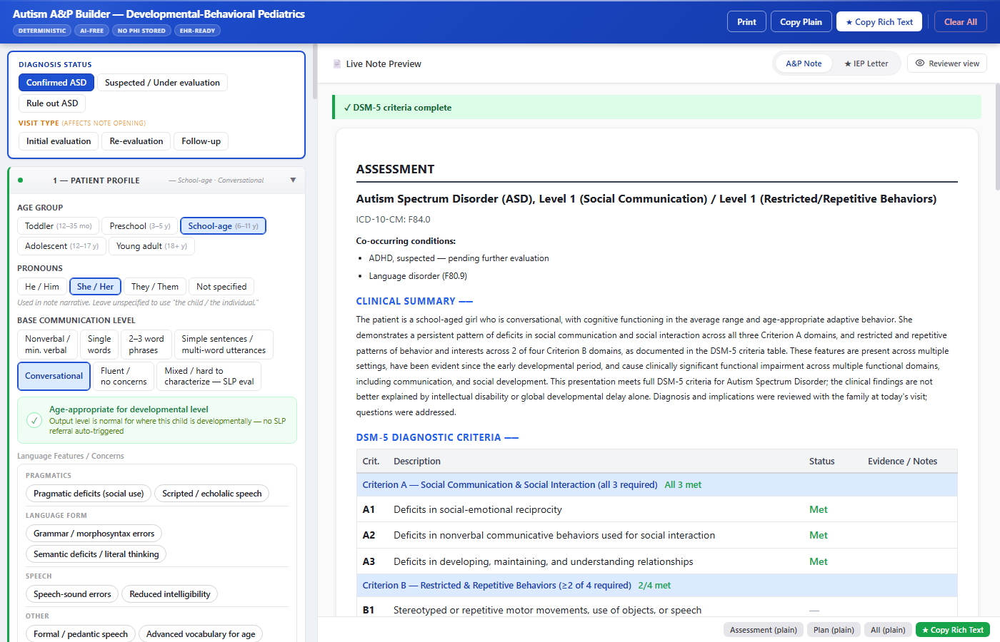

# DBP Autism A&P Builder

A single-file clinical note generator for pediatric autism evaluations. Produces a full Assessment & Plan note, an ABA Letter of Medical Necessity, and an IEP physician letter — all from one set of checkboxes.

**Try it now:** https://dmatsib000-create.github.io/autism-ap-builder/autism-ap-builder.html

**Reference docs:**

- [Clinician's guide](docs/branching-logic-for-clinicians.html) — plain English; what the tool decides and why, with diagrams and vignettes
- [Technical reference](docs/branching-logic.md) — for maintainers and future Claude Code sessions making code changes

## Why this tool exists

The tool generates a full A&P note, ABA Letter of Medical Necessity, and IEP physician letter in about 15 minutes — three deliverables that, at this level of detail, would otherwise take an hour or more, and that most clinical workflows skip or shortcut entirely. One form on the left; three coordinated outputs on the right, updating in real time as you check boxes. No more staring at a blank Epic note after a 90-minute evaluation visit.

The point isn't only speed. The tool catches the things that are easy to forget after a long visit — DSM-5 specifiers, therapy justifications, referral logic for comorbid presentations, IEP service-specific rationales — and ensures they land in every note that needs them. When all three deliverables come from one shared input, they say the same thing about the same patient, with the same clinical reasoning behind each recommendation.

Across a clinic, that consistency matters. Two clinicians seeing similar patients produce notes built on the same evidence-based rules, which means insurance reviewers see consistent justifications for ABA hours, school districts see consistent rationales for IEP services, and approval rates rise as a result. The tool was built by a general pediatrician at the UF Behavior and Development Clinic to address persistent gaps in autism documentation that Epic SmartForms don't cover and in-Epic AI assistants don't help with.

The tool does not replace clinical judgment, the evaluation itself, or any diagnostic decision-making. It writes up what you decide; it doesn't decide for you.

**Who this tool is for:** developmental-behavioral pediatricians, neurodevelopmental specialists, and general pediatricians practicing in developmental-behavioral clinic settings — clinicians who already perform autism evaluations and write the resulting A&P, ABA medical-necessity, and IEP physician documentation. Clinicians outside that workflow (e.g., a community pediatrician seeing the patient once for a different concern) may not have the standing or scope to send ABA Letters of Medical Necessity or IEP physician letters in their jurisdiction; check your institutional and payer requirements before using the letter outputs in a setting outside specialty developmental clinics.

---

# Part 1 — For clinicians using this tool

## Quick start

A 5-minute walk-through using a worked example. Open the [live tool](https://dmatsib000-create.github.io/autism-ap-builder/autism-ap-builder.html) in a separate tab and follow along.

**The patient:** Maya, age 7, new ASD evaluation referred by her pediatrician. Parent reports speech delays since age 2, difficulty with peer interaction in second grade, and ongoing attention/restlessness concerns at school. Currently in general education with no IEP.



### The minimum to produce a complete A&P note

The eight categories below cover the minimum to generate an A&P note without the ⚠ Incomplete badge. Most categories are a single click; the DSM-5 Criteria step (#7) is itself eight individual checkboxes, so the full minimum is closer to 15 clicks.

1. **Patient Profile → Age Group:** *School-age*
2. **Patient Profile → Pronouns:** *She*
3. **Patient Profile → Base Communication Level:** *Conversational* (Maya speaks in full sentences with peers)
4. **Diagnostic Workup → Diagnosis status:** *Confirmed*
5. **Diagnostic Workup → ASD Severity (Social Communication):** *Level 1 — Requiring support*
6. **Diagnostic Workup → ASD Severity (RRB):** *Level 1 — Requiring support*
7. **DSM-5 Criteria Evidence:** check all three A criteria, at least two of four B criteria, and C/D/E
8. **Functional Need Domains:** check at least one need (e.g., *Social → Peer interaction*) — this drives therapy referrals

At this point the A&P Note tab on the right shows a complete clinical summary, DSM-5 criteria table, problem-based plan with auto-triggered therapy referrals (SLP, ABA, social skills group), safety counseling section, and return-to-clinic interval.

### Recommended additions for a polished note

The eight above produce a clinically defensible note. These six additions are what turn it into a complete documentation package:

- **Patient Profile → Cognitive Profile** (e.g., *Average*) — affects the clinical summary and the genetics referral framing
- **Patient Profile → Adaptive Behavior** — captures functional impairment level for the plan
- **Diagnostic Workup → Prior testing reviewed** — entering ADOS-2 / CARS-2 / Vineland-3 outcomes pulls them into the clinical summary and ABA/IEP letters as supporting evidence
- **Comorbid Conditions** — for Maya, you'd check ADHD (suspected) + Language Disorder; each generates its own Assessment & Plan block
- **School & Educational Supports → Documentation status:** *No IEP / 504 — needs evaluation* — unlocks the IEP Letter tab on the right
- **ABA Letter Parameters** (insurance type, requested hours, setting) — populates the ABA Letter with a complete medical-necessity case

### Copy the note into Epic

The A&P Note tab has three buttons in the top toolbar: **Print**, **Copy Plain**, and **★ Copy Rich Text**. For Maya's note, click **Copy Rich Text** → switch to Epic → paste into the note composer; formatting (bold, bullets, section structure) is preserved.

The ABA Letter and IEP Letter tabs each have their own per-tab toolbar with a third option: **Copy for Epic (`***`)**. This copies the letter as plain text with every `{placeholder}` field replaced by `***` Epic cursor stops — once pasted into the Epic note composer, you can Tab through and fill or skip each placeholder. Use this for the letter tabs; use Rich Text for the A&P note.

### If you see ⚠ Incomplete

The DSM-5 Criteria section shows a live badge: ✓ All criteria met when complete, or ⚠ Incomplete with the specific gap (e.g., `A: 2/3 documented`). Almost all incomplete states are missing checks in Criteria A or B. Scroll back to Section 3 and verify all three A criteria are checked and at least two B criteria are checked.

### The other two tabs

The **ABA Letter** and **IEP Letter** tabs activate as their inputs are populated. The ABA Letter tab appears when the ABA referral fires (see Auto-logic in Part 2 for the full trigger list — it's needs-driven, not gated on diagnosis status alone) or is manually included via Adjust Referrals. The IEP Letter tab appears when school documentation status is set and the patient is not a toddler. Both tabs use the same one-form-three-outputs model — you don't enter anything separately, the letters auto-generate from the same checkboxes that drove the A&P note.

## What you get

One form on the left produces three coordinated outputs on the right. You don't enter anything separately for the ABA Letter or IEP Letter — they're derived from the same state that drives the A&P note.

| Output tab | What it contains | When the tab appears |
|---|---|---|
| **A&P Note** | Clinical summary (auto-generated narrative covering age, visit type, language, cognitive profile, DSM-5 status, severity levels, prior testing, specifiers); DSM-5 criteria table with evidence text; problem-based plan including therapy referrals with clinical rationale, medical referrals (genetics with AMA-cited guideline framing, neurology, audiology, GI, etc.), safety counseling, anticipatory guidance, and return-to-clinic interval | Always visible |
| **ABA Letter** | Pre-filled medical-necessity intro paragraph; diagnosis statement with DSM-5 specifiers and severity level (uses max of Social Communication and RRB so highest support need drives authorization); requested weekly hours; recommended setting(s); treatment targets each with a one-sentence clinical rationale; authorization period and therapist signature block | When the ABA referral fires (see Auto-logic — needs-driven, not gated on diagnosis status alone) or is manually included via the Adjust Referrals section |
| **IEP Letter** | IDEA-branch-appropriate opening (initial evaluation request / amendment / 504 upgrade / rule-out evaluation support); diagnosis statement with DSM-5 specifiers and severity; educational impact bullets; one rationale paragraph per requested school service; accommodation list; statutory citations (IDEA §300.301 / §300.302 / §300.324) | When school documentation status is set AND age group is not toddler (toddlers route through Early Steps, not K-12 IDEA) |

> *Concrete output may evolve as the tool's prose generators are updated. The fragments below are illustrative as of May 2026 — re-verify against live output if precise wording matters for your workflow.*

<!-- AI MAINTENANCE NOTE: Re-verify the sample fragments below when generateClinicalSummary(), _abaContent(), or _iepLetterContent() prose changes. The drift-warning date above should also be updated to reflect when samples were last validated. -->

**A&P note — clinical summary opening:**
> Marcus is a school-aged child evaluated today for autism spectrum disorder. He presents with conversational language, cognitive functioning in the average range, and mildly impaired adaptive behavior relative to chronological age...

**ABA Letter — treatment target with clinical rationale:**
> Reduction of self-injurious behavior (SIB): SIB is a Behavior of Danger; even infrequent events carry risk of permanent injury. A function-based behavior intervention plan (BIP) is required; FBA must precede intervention. Medical and behavioral co-management indicated.

**IEP Letter — service-rationale paragraph:**
> Speech-Language Pathology (school-based): Recommended to address pragmatic language deficits, including difficulty with conversational reciprocity, perspective-taking in social exchanges, and contextual understanding of figurative language. Service is medically necessary to support access to general education curriculum per IDEA §300.34.

## What this tool does not do

A few boundaries to know before you rely on the output. Read this section before sending any letter to a school district, ABA agency, or insurance reviewer.

- **Doesn't make clinical decisions or replace the evaluation itself.** The tool writes up decisions you've already made — diagnostic determination, severity assignment, comorbidity recognition, therapy choice. History-taking, observation, examination, and clinical judgment remain yours; the tool has no role in any of those.

- **Doesn't verify ICD-10 codes, billing codes, dates, or signatures.** Always verify these against your encounter and your institution's billing requirements before submission. The codes embedded in the output are clinically accurate but not validated for your specific payer or visit type.

- **Doesn't guarantee insurance or school approval.** The tool provides guideline-aligned justification language for ABA Letters of Medical Necessity and IEP physician letters; approval still depends on the reviewing payer or school district. Strong documentation reduces denial rates but does not eliminate them.

- **Doesn't auto-update cited guidelines.** Citations (e.g., AAP 2025 genetics evaluation guidance, Srivastava 2019 consensus statement) are accurate as of the date the tool was authored. Always verify currency before letters go out — guidelines change, and the tool will not warn you.

- **Doesn't save your inputs between sessions.** The form is stateless by design (no PHI is stored or transmitted). Closing the browser tab discards everything. Copy your outputs into Epic *before* closing the tab.

- **Doesn't integrate with Epic or any other EMR.** Copy-paste is manual. The Copy for Epic (`***`) button produces Epic SmartText-compatible output with Tab-navigable cursor stops, but the paste itself is a manual step.

- **Doesn't cover every neurodevelopmental presentation.** Focused on autism evaluations with common comorbidities (ADHD, anxiety, depression, OCD, trauma, language disorder, SLDs, sleep, GI, PFD/ARFID, epilepsy, ID/GDD, catatonia). Less common comorbidities (Fragile X, Rett, Tourette's, etc.) are not yet in the checkbox lists — note them manually in the relevant free-text fields.

## Deploying in your clinic

Two paths. The first is recommended for almost everyone.

### Option A — Use the live URL (recommended)

Open the [live tool](https://dmatsib000-create.github.io/autism-ap-builder/autism-ap-builder.html) and use it. No install, no sign-up, no account. The page is a single static HTML file served from GitHub Pages.

**What this means for PHI:** the entire tool runs locally in your browser. There is no backend, no telemetry, no analytics, no third-party fetches, no data ever sent off your machine. The patient information you enter exists only in the open browser tab and is gone the moment you close it. You can use it offline by saving the page (`Ctrl+S` → "Webpage, Complete") and opening the saved file later.

UF-specific references (CARD center contact info; "UF Behavior and Development Clinic" in the IEP letter signature) will appear in your output as written. For most outside clinicians using the tool occasionally, this is acceptable — you can simply edit them out of the copied output before pasting into your EMR.

### Option B — Fork and host your own copy

For clinics that want to customize the UF-specific references at the source, brand the tool for their institution, or host on their own domain.

> **Licensing note:** the repository does not currently have an explicit open-source license. Outside clinicians are welcome to use the live URL (Option A) freely. If you want to fork, modify, or redistribute the source, please [open a GitHub Issue](https://github.com/dmatsib000-create/autism-ap-builder/issues) first to discuss — licensing intent will be formalized as adoption grows.

If licensing is sorted, the technical setup for a self-hosted GitHub Pages copy:

1. **Fork the repo.** Sign in to GitHub, navigate to https://github.com/dmatsib000-create/autism-ap-builder, click the **Fork** button (top right). This creates a copy under your own GitHub account.
2. **Enable GitHub Pages.** In your forked repo, go to **Settings → Pages** (left sidebar). Under "Build and deployment," set Source to **Deploy from a branch**, Branch to **main**, folder to **/ (root)**. Click Save.
3. **Wait for the build.** GitHub Pages typically deploys in about a minute. Refresh the Pages settings page until you see "Your site is live at https://YOUR-USERNAME.github.io/autism-ap-builder/".
4. **Visit your copy** at `https://YOUR-USERNAME.github.io/autism-ap-builder/autism-ap-builder.html`. It's now yours to customize.
5. **Customize UF-specific references.** Open `autism-ap-builder.html` in any text editor and search for `card.ufl.edu`, `(352) 273-0517`, and `UF Behavior and Development Clinic`. Replace each with your institution's equivalents. Commit and push; the live copy updates automatically on next deploy.

### Reporting bugs or requesting features

[GitHub Issues](https://github.com/dmatsib000-create/autism-ap-builder/issues) is the channel for both — bug reports, feature requests, and adoption questions. PRs welcome from forks once licensing is formalized.

<!-- AI MAINTENANCE NOTE: This section's UF customization list (CARD contact info, IEP letter signature line) reflects the touch-points as of May 2026. When new UF-specific references are added elsewhere in autism-ap-builder.html, the Option B customization step above should be updated. Search the file for "UF", "Florida", "Gainesville", and "card.ufl.edu" to verify the list is current. -->


---

# Part 2 — Reference for maintainers and power users

## Glossary

Quick decoder for the acronyms and short forms used in the rest of this document. Florida-specific items are flagged because outside-Florida adopters will need to substitute local equivalents.

**Diagnostic frameworks and codes**
- **DSM-5** — Diagnostic and Statistical Manual of Mental Disorders, 5th edition (APA)
- **ICD-10** — International Classification of Diseases, 10th revision (WHO billing codes)
- **AAP 2025** — American Academy of Pediatrics 2025 clinical report on genetic evaluation of GDD/ID
- **Srivastava 2019** — Srivastava et al., 2019 consensus statement on exome sequencing as first-tier NDD testing

**Severity / DSM-5 specifiers**
- **SC** — Social Communication (DSM-5 ASD severity domain)
- **RRB** — Restricted/Repetitive Behaviors (DSM-5 ASD severity domain)
- **ID** — Intellectual Disability
- **GDD** — Global Developmental Delay (DSM-5 placeholder diagnosis for children under 5)
- **BIF** — Borderline Intellectual Functioning (IQ ~70–84)

**Therapy approaches**
- **ABA** — Applied Behavior Analysis
- **EIBI** — Early Intensive Behavioral Intervention (early-childhood ABA service model)
- **NDBI** — Naturalistic Developmental Behavioral Intervention
- **PCIT** — Parent-Child Interaction Therapy
- **SLP / OT / PT** — Speech-Language Pathology / Occupational Therapy / Physical Therapy
- **AAC** — Augmentative and Alternative Communication

**Comorbidities and clinical conditions**
- **ARFID** — Avoidant/Restrictive Food Intake Disorder
- **PFD** — Pediatric Feeding Disorder
- **DCD** — Developmental Coordination Disorder
- **SLD** — Specific Learning Disorder
- **OCD** — Obsessive-Compulsive Disorder
- **SIB** — Self-Injurious Behavior
- **ESES** — Electrical Status Epilepticus during Sleep
- **Landau-Kleffner syndrome** — acquired epileptic aphasia with EEG abnormalities

**Behavior intervention terms**
- **FBA** — Functional Behavior Assessment
- **BIP** — Behavior Intervention Plan
- **BCBA-D** — Board Certified Behavior Analyst with Doctoral designation
- **Behaviors of Danger** — clinical category for SIB, aggression, elopement, and pica (used in ABA letter prose to flag behaviors warranting immediate function-based BIP)
- **Tier 2 interfering behaviors** — tantrums, noncompliance, property destruction, disruptive vocalizations (non-emergent behaviors that interfere with function but aren't immediate dangers)

**Other**
- **AMA-style citation** — formatting convention from the American Medical Association Manual of Style; uses superscript numerical markers in prose and a numbered reference list (distinct from "AMA" as in "against medical advice")
- **SPED** — special education / specialized academic instruction (school-based service category)
- **NAMI** — National Alliance on Mental Illness (caregiver mental-health support resource referenced in Family Resources output)
- **SmartText / SmartForms** — Epic terminology for reusable text templates with cursor-stop navigation (the `***` Epic copy format produces SmartText-compatible output)

**Educational / IDEA**
- **IDEA** — Individuals with Disabilities Education Act (U.S. federal law governing special education)
- **IEP** — Individualized Education Program
- **504** — Section 504 of the Rehabilitation Act (accommodations plan, less formal than IEP)
- **FAPE** — Free Appropriate Public Education (IDEA core entitlement)
- **ESY** — Extended School Year services
- **ESE** — Exceptional Student Education (Florida's term for special education)

**Assessment instruments**
- **ADOS-2** — Autism Diagnostic Observation Schedule, 2nd ed.
- **CARS-2** — Childhood Autism Rating Scale, 2nd ed. (ST = Standard, HF = High-Functioning forms)
- **ADI-R** — Autism Diagnostic Interview, Revised
- **ASD-PEDS** — Autism Spectrum Disorder–Pediatric Evaluation of Developmental Status
- **MIGDAS-2** — Monteiro Interview Guidelines for Diagnosing the Autism Spectrum, 2nd ed.
- **SRS-2** — Social Responsiveness Scale, 2nd ed.
- **GARS-3** — Gilliam Autism Rating Scale, 3rd ed.
- **RITA-T** — Rapid Interactive Screening Test for Autism in Toddlers
- **Vineland-3** — Vineland Adaptive Behavior Scales, 3rd ed.
- **ABAS-3** — Adaptive Behavior Assessment System, 3rd ed.
- **SIB-R** — Scales of Independent Behavior, Revised
- **DABS** — Diagnostic Adaptive Behavior Scale
- **BASC-3** — Behavior Assessment System for Children, 3rd ed.
- **Conners 4** — Conners Comprehensive Behavior Rating Scales, 4th ed. (ADHD screening)
- **KBIT-2R** — Kaufman Brief Intelligence Test, 2nd ed. Revised (cognitive screener — not sufficient for DSM-5 ID diagnosis)
- **QbTest** — Quantified Behavior Test (FDA-cleared objective ADHD measurement)

**Florida-specific resources** (substitute local equivalents if deploying outside Florida)
- **UF CARD** — University of Florida Center for Autism and Related Disabilities (caregiver support, training, community resources)
- **APD** — Agency for Persons with Disabilities (Florida — Medicaid waiver and community support)
- **Early Steps** — Florida's IDEA Part C program for infants and toddlers with developmental delays
- **FDLRS** — Florida Diagnostic and Learning Resources System (preschool early-intervention network for children not yet in public school)

**Tool-internal conventions**
- **Add-only** — auto-population helpers add checks but never remove them; the clinician's manual unchecks persist across re-renders
- **The bridge** — the cognitive-profile → DSM-5 specifier auto-link (described in Auto-logic section)
- **Override pill** — the three-state Auto/Include/Exclude toggle in the Adjust Referrals section that overrides a referral rule
- **`{placeholder}` field** — bracketed text in letter output that the clinician fills in after copying (e.g., `{Student Name}`); the Copy for Epic format replaces these with `***` cursor stops

## Input sections

### 1 — Patient Profile
- **Age group:** Toddler / Preschool / School-age / Adolescent / Young adult. Age group gates several features: RITA-T and CARS-2 pathways, community independence checkbox, social skills group resources, transition planning language, and IEP tab visibility.
- **Pronouns:** He / She / They / Not specified — used throughout note and IEP letter.
- **Visit type:** Initial evaluation / Re-evaluation / Follow-up — sets opening sentence of clinical summary.
- **Base Communication Level:** Nonverbal / min. verbal → Single words → 2–3 word phrases → Simple sentences → Conversational → Fluent / no concerns → Mixed / hard to characterize (SLP eval). A green **"Age-appropriate for developmental level"** qualifier card sits below the radio — checking it signals the output level is normal for the child's developmental stage and suppresses SLP / communication auto-triggers without changing the selected level. **Language Features / Concerns** chip strip (domain-grouped): Pragmatics (pragmatic deficits, echolalic / scripted speech), Language Form (morphosyntax errors, semantic deficits / literal thinking), Speech (speech-sound errors, reduced intelligibility), Other (formal / pedantic speech, advanced vocabulary). Selecting nonverbal or single words automatically checks expressive language needs (and functional AAC for nonverbal) in the Communication domain. This auto-population is **add-only** — meaning the auto-logic adds checks but never removes them, so any manual unchecks you make persist across re-renders. This convention applies throughout the tool's auto-population helpers.
- **Cognitive profile:** Severe / Moderate / Mild ID → GDD (unspecified / mild / moderate / severe) → Borderline (BIF) → Low average → Average → High average (110–119) → Superior (120–129) → Very superior / gifted (130+) → Unknown / under evaluation. ID options are hidden and cleared for toddler/preschool (DSM-5: ID requires reliable standardized testing, typically ≥5 years). GDD options are hidden and cleared for school-age and older. Selecting a cognitive option automatically pre-checks the matching DSM-5 specifier.
- **Cognitive Data Source:** Comprehensive eval this visit / Prior external testing / Screener only (KBIT-2R, etc.) / Clinical impression only. Combined with the adaptive evidence flag below, this gates whether the auto-checked DSM-5 specifier is `withID` (confirmable) or `withSuspectedID` (provisional). Only `comprehensive` and `priorExternal` source values can produce a confirmable specifier.
- **Adaptive behavior:** Severely / moderately / mildly impaired → Below cognitive potential → Commensurate with cognitive level → Age-appropriate / WNL. A **"Based on standardized adaptive assessment"** checkbox below the radio signals that the impairment level reflects a formal measure (Vineland-3, ABAS-3, SIB-R, DABS, or BASC-3 adaptive) — required for DSM-5 ID/GDD confirmation. Without it (or without a `consistent` Vineland-3 or BASC-3 in Prior Testing), the cognitive-profile-to-specifier bridge (described under Auto-logic below) holds the specifier in `withSuspectedID` / `withSuspectedGDD`.
- **Identified strengths:** Free-text field with clickable chips (visual learner, strong memory, hyperlexia, special interests, etc.). Hyperlexia is documented here — it auto-triggers SLP referral and psychoeducational evaluation via text-search on this field.

### 2 — Diagnostic Workup & Next Steps
- **Diagnosis status:** Confirmed / Suspected / Rule-out — changes note language, ICD-10 codes, and IEP letter branch throughout.
- **ASD severity levels (SC and RRB):** Levels 1–3 per DSM-5's two-domain model; justification text boxes included. ABA and IEP letters use `max(SC, RRB)` so the highest support need across either domain drives authorization and educational placement.
- **Specifiers:** `withLang`, `withID`, `withSuspectedID`, `withGDD`, `withSuspectedGDD`, `withBIF`, `withoutID`, `withoutGDD`, `withGenetic`, `withNDD`, plus catatonia. The ID/GDD/BIF group is mutually exclusive (only one member checked at a time). Clicking a specifier whose compat set doesn't include the current cogProfile clears the cogProfile (back-propagation); selecting a cogProfile auto-checks the matching specifier (forward bridge). Suspected vs confirmed status follows from the cogDataSource and adaptive-evidence gating described in Section 1.
- **Diagnostic eval path:** Selects which evaluation route is documented (CARS-2 scheduled, ADOS-2 uncertain, RITA-T, development-only, etc.).
- **Prior testing reviewed:** CARS-2 ST/HF, ADOS-2 (with module), ADI-R, ASD-PEDS, MIGDAS-2, SRS-2, GARS-3 — each with outcome dropdown (Consistent / Equivocal / Not consistent). Vineland-3, BASC-3, and Conners 4 included as behavioral/adaptive instruments; Vineland-3 or BASC-3 with a `consistent` outcome can satisfy the adaptive-evidence requirement for an ID/GDD specifier confirmation. Consistent results are cited automatically in the ABA Letter and IEP Letter.
- **CARS-2 completed at this visit:** Flips CARS-2 note language from future to past tense.
- **Seizure concern:** Checkbox for non-emergent seizure history (triggers EEG referral); sub-checkbox to also refer to neurology now without waiting for EEG result.

### 3 — DSM-5 Criteria Evidence
- Checkboxes for A1, A2, A3 (all required) and B1–B4 (≥2 required), plus C/D/E specifying criteria.
- Free-text evidence boxes under each criterion for specific clinical examples.
- Live badge shows criteria met count and whether threshold is reached.
- **B2 (insistence on sameness)** automatically populates `rigidity` in the behavioral needs Set, which activates transition accommodations, counseling school-service auto-select, and IEP transition impact language.

### 4 — Functional Need Domains
Six domain Sets, each with specific checkboxes:

| Domain | Examples |
|---|---|
| **Communication** | Expressive, receptive, pragmatic, functional AAC |
| **Behavior** | Aggression, SIB, elopement, tantrums, noncompliance, property destruction, pica, disruptive vocalizations |
| **Adaptive / Self-care** | Toileting, dressing, feeding ADL, hygiene, community safety, community independence |
| **Sensory** | Auditory, tactile, visual, vestibular/proprioceptive, oral |
| **Motor** | Fine motor, handwriting, gross motor, coordination/praxis |
| **Social** | Peer interaction, play, perspective-taking, emotional recognition, conversation, reciprocity |

Checked items auto-populate ABA targets and school services (see Auto-logic below).

**Additional Domains** (below the six domain Sets):
- **Regulatory / Behavioral:** Emotional regulation difficulties (with optional frequency/description), academic / learning difficulties
- **Medical:** Feeding difficulties, sleep difficulties, behavioral hearing screen inconclusive, seizure concern (with sub-checkbox to refer to neurology now), suspicion for sleep-disordered breathing, focal neurological findings
- **Genetics-relevant exam findings** (drives the Genetics referral language and expands the conditions under which the Genetics referral fires when ASD is not yet confirmed):
  - **Dysmorphism** radio: No concern / Suspected dysmorphology / Confirmed dysmorphic features (geneticist-documented). Suspected dysmorphology alone does not trigger a genetics referral — pair with another flag or a confirmed diagnosis.
  - **Congenital anomalies on physical examination** checkbox.
  - **Documented developmental regression** checkbox. When checked, reveals a sub-radio for **Regression timing**: Ongoing or recent (weeks to months) / Distant, currently stable (≥1 year ago) / Timing unclear from records. Timing changes the urgency framing in both the genetics referral and the neurology referral prose.
- **Support Services:** Social work referral (with sub-checklist for reason — APD/Medicaid waiver, financial counseling, caregiver support, community navigation, family support, family safety).

**Behavior frequency inputs:** For Tier 2 interfering behaviors (tantrums, noncompliance, property destruction, disruptive vocalizations) and emotional regulation, an optional text field appears when the behavior is checked. If filled, the description is appended to that behavior in the ABA medical necessity paragraph (e.g., "tantrums/meltdowns (3–5x/day, 10–20 min each)"). If left blank, the behavior name alone appears — no placeholder, no post-copy editing required.

### 5 — Comorbid Conditions
Checkboxes for co-occurring diagnoses with ICD-10 codes. Each generates its own Assessment and Plan block in the note when "Include plan" is toggled:

- ADHD (combined / inattentive / hyperactive / suspected)
- Anxiety disorder
- Major depressive disorder
- OCD
- Trauma / adverse childhood experiences — appears in the A&P note by default; inclusion in the IEP letter is gated behind an explicit per-letter opt-in sub-checkbox (default off) since the IEP letter becomes part of the cumulative educational record. When on, the IEP letter uses functional language ("additional psychosocial history with ongoing impact on emotional regulation and stress response") rather than the ICD-10 code, and a reminder banner above the letter preview prompts the clinician to verify family consent.
- Language disorder
- Specific learning disorders — reading (dyslexia), math, written expression, or suspected (domain-uncharacterized). Suspected SLD is mutually exclusive with the confirmed-domain options.
- DCD (developmental coordination disorder)
- Sleep disorder
- GI issues
- Pediatric Feeding Disorder — chronic, acute, or suspected
- ARFID (Avoidant/Restrictive Food Intake Disorder)
- Epilepsy / seizure disorder
- Intellectual disability / Global developmental delay (suspected or confirmed)
- Catatonia

### 6 — School & Educational Supports
- **School placement** and **documentation status** (IEP / 504 / neither / needed).
- **School services:** Checkboxes for SLP, OT, PT, counseling, social skills group, 1:1 aide, ESY, low ratio classroom, sensory accommodations, visual supports, FBA, psychoeducational evaluation, specialized academic instruction.
- Services can be manually toggled on or off; auto-selected services show a blue "auto" badge.
- **IEP tab** appears when school documentation is set and age group is not toddler (toddlers use Early Steps, not K-12 IDEA).

### 7 — Safety Counseling
Checkboxes for safety topics addressed at the visit: elopement/wandering, road safety, water safety, fire/heat, SIB safety, medication safety, online safety, bullying/victimization, stranger danger / reduced protective response. Each generates a dedicated safety counseling documentation paragraph.

### 8 — Anticipatory Guidance
Topics addressed with family: ABA overview, school/IEP, sleep, feeding, communication strategies, caregiver support, sibling guidance, transition planning, UF CARD, social skills, puberty, driving, and more.

### ABA Letter Parameters *(appears when ABA is included)*
- Insurance type, requested hours/week, therapy settings (home / clinic / school / community / telehealth).
- ABA target checkboxes (pre-populated by auto-logic, manually adjustable).
- ABA start date, authorization period, therapist name fields.

### Adjust Referrals
Each therapy and referral has an Auto / Include / Exclude pill toggle, allowing the clinician to override the auto-logic without losing the override on re-render.

## Auto-logic

The tool uses rule functions and sync helpers to reduce repetitive data entry.

### Therapy referrals (auto-triggered)

| Therapy | Triggers |
|---|---|
| ABA | Any of: toddler or preschool age group; nonverbal/minimally verbal; confirmed ID (hasID + `withID` specifier); significant adaptive impairment; any behavioral need; any safety need; functional AAC need; ASD Level 2 or 3. (ABA fires on needs/age/severity, not on ASD diagnosis status alone.) |
| SLP | Any communication need; any language level other than "Fluent / no concerns" unless the age-appropriate qualifier is active; any language feature chip (pragmatic, echolalic, morphosyntax, semantic, speech-sound, reduced intelligibility, pedantic, hyperlexia); language disorder comorbid |
| OT | Sensory needs, fine motor / handwriting / coordination needs, any adaptive need, DCD comorbid |
| PT | Gross motor needs, coordination needs, DCD comorbid |
| Psychotherapy | School-age, adolescent, or young adult AND verbal-enough AND any of: anxiety, depression, OCD, trauma, emotional regulation flag, OR adolescent/young-adult + boundary-violation behaviors |
| PCIT | Toddler, preschool, or school-age (NOT adolescent/young adult) AND any of: aggression, tantrums, noncompliance, property destruction, ADHD, anxiety, trauma |
| Social skills group | Preschool, school-age, or adolescent (NOT young adult) AND not minimally verbal AND (any social need OR boundary-violation behaviors) |
| Genetics | Confirmed ASD, OR diagStatus non-empty AND any of: developmental regression, confirmed dysmorphology, congenital anomalies. Suspected dysmorphology alone does not trigger. |
| Neurology | Epilepsy comorbid, focal neurological findings, "refer neurology now" checkbox, OR developmental regression (any timing) |
| Psychiatry | Confirmed ADHD, anxiety, depression, or OCD, OR (aggression or SIB AND school-age/adolescent/young-adult) |
| GI | GI comorbid, feeding concern, any PFD variant (chronic/acute/suspected), any ARFID variant (confirmed/suspected), pica |
| Audiology | Hearing screen fail (any age), OR toddler/preschool + (speech-sound errors OR reduced intelligibility OR morphosyntax errors) |
| QB Test | ADHD suspected comorbid AND school-age, adolescent, or young adult |
| Early Steps | Toddler **only** AND (confirmed OR suspected ASD) |
| FDLRS | Preschool **only** AND not in public school AND (confirmed OR suspected ASD) — FDLRS is a Florida-specific early intervention network |
| EEG | Seizure concern checkbox |
| CARD | Confirmed ASD (UF Center for Autism and Related Disabilities) |

All referrals can be overridden via the Adjust Referrals section.

### Genetics referral prose branching

When the genetics referral fires, the lead sentence and modifier list adapt to the patient's state:

- **Lead sentence** has three variants:
  - `diagStatus === 'confirmed'` → "The patient carries a confirmed neurodevelopmental diagnosis…"
  - `diagStatus !== 'confirmed'` AND ongoing regression → "The patient is under evaluation for a neurodevelopmental disorder…" (the urgency parenthetical in the modifier list carries the medical-necessity argument; the "warrant genetics input" hedge is omitted to avoid stacking)
  - Any other under-evaluation case → "…under evaluation… with clinical findings that warrant genetics input during the diagnostic workup"
  - Override-forced with no clinical flags → "…under evaluation…; genetics input is requested per clinician judgment"
- **Severity modifier** (`sevPhrase`) inserts ", with co-occurring intellectual disability or global developmental delay (severity influences expected diagnostic yield)" when `hasID()` is true or any of `withGDD` / `withSuspectedGDD` / `withSuspectedID` specifiers are checked.
- **Modifier list** (`addFlags`) appends comma-joined clauses for: confirmed dysmorphic features, features suggestive of possible dysmorphology pending formal evaluation, congenital anomalies on physical examination, and developmental regression with timing-appropriate framing (ongoing → urgent; distant → routine; unsure → expedited pending clarification).

The references block at the end of MEDICAL REFERRALS emits AMA-style citations for AAP 2025 and Srivastava 2019 when the genetics referral fires; the in-prose superscripts (¹, ²) and the numbered reference list are coupled by convention, not by a shared data structure.

### Neurology referral prose branching

The neurology line composes one clause per active trigger (focal neurological findings, epilepsy, developmental regression, neurologyNowForSeizure-only fallback) so concurrent triggers each contribute their own clause rather than silently dropping. For developmental-regression-only triggers, the prose varies by timing: ongoing → "Urgent evaluation… consider EEG (rule out Landau-Kleffner / ESES), MRI, and metabolic workup"; distant → "Routine evaluation… expedited evaluation not required unless trajectory changes"; unsure → "Expedited evaluation… clarify trajectory."

### ABA target auto-population

Checking needs checkboxes and DSM-5 criteria automatically checks the corresponding ABA targets:

- Elopement (need) OR safety counseling for elopement → Reduce elopement
- SIB (need) OR safety counseling for SIB → Reduce self-injurious behavior
- Aggression or property destruction (needs) → Reduce aggression
- Tantrums (need) or emotional regulation flag → Reduce tantrums / emotional dysregulation
- Pica (need) → Reduction of pica
- Vocal disruption, B1 (stereotypy), OR any behavioral need → Reduce stereotypy
- Boundary-violation behaviors → Boundary skills
- Play or peer-interaction social needs → Play skills / peer interaction
- Expressive, receptive, or functional-AAC communication needs → Functional communication
- Toileting, dressing, or feeding-ADL adaptive needs → Self-help / ADL
- Community safety or community independence (adaptive needs) → Safety skills
- Menstrual-care adaptive need → Menstrual care skills
- Confirmed severe or moderate ID (cogProfile) → Self-help / ADL (additional trigger beyond adaptive needs above)
- Academic flag → Academic readiness / instruction-following — **toddler/preschool only** (excluded for school-age+ because academic instruction is the school district's FAPE obligation under IDEA, and academic ABA targets are a frequent claims-examiner denial reason for older children)
- Toddler/preschool + (any social or communication need) → Joint attention AND Imitation
- B2 (insistence on sameness) → Transitions; also pushes `rigidity` into needsBehavior, activating downstream transition accommodations, counseling auto-select, and IEP language
- Emotional regulation flag → Self-regulation and coping strategies

ABA target auto-population is **add-only** — manually unchecked targets are not re-checked on re-render. Exception: `rigidity` is derived from B2 and cleared when B2 is unchecked (no standalone checkbox to maintain manual state).

### Communication needs auto-population

Selecting a language level automatically pre-checks communication functional needs:

| Language level | Auto-checked |
|---|---|
| Nonverbal / min. verbal | Expressive language delays + Functional AAC needs |
| Single words, 2–3 word phrases, Simple sentences | Expressive language delays |
| Conversational, Fluent / no concerns | *(none)* |

Suppressed entirely if the age-appropriate qualifier card is checked. Add-only — manual unchecks are respected.

### Cognitive profile ↔ DSM-5 specifier bridge

Selecting a cognitive profile auto-checks the matching ID/GDD/BIF specifier. Whether the specifier is the confirmed (`withID`, `withGDD`) or suspected (`withSuspectedID`, `withSuspectedGDD`) variant depends on the **Cognitive Data Source** + **adaptive evidence** gating:

- `cogDataSource === 'comprehensive'` OR `'priorExternal'` → eligible for confirmed variant
- AND a formally impaired adaptive profile (severely / moderately / mildly impaired or below cognitive potential)
- AND either a `consistent` Vineland-3 / BASC-3 in Prior Testing, OR the "Based on standardized adaptive assessment" checkbox is on

If all three conditions are met → confirmed specifier. Otherwise → suspected specifier.

**Back-propagation:** clicking a specifier whose compat set doesn't include the current cogProfile clears the cogProfile and resets the cogDataSource / adaptive-evidence flags (and unchecks the standardized-assessment checkbox).

### School service auto-population

- Communication needs, language level non-fluent (without age-appropriate qualifier), language disorder comorbid, conversation/reciprocity social needs, pragmatic deficits, pedantic speech, or echolalia → SLP school-based service
- Sensory, fine motor, handwriting, coordination, any adaptive need, or DCD comorbid → OT school
- Gross motor or DCD comorbid → PT school
- Any social need OR boundary-violation behaviors → Social skills school
- Any behavioral need → FBA
- Elopement, aggression, SIB, vocal disruption, or pica → Aide + FBA (the more dangerous behaviors escalate from FBA-only to FBA + 1:1 aide)
- Anxiety, depression, confirmed or suspected ADHD, OCD, trauma, rigidity (from B2), emotional regulation, or boundary-violation behaviors → Counseling
- LD suspected OR (school-age+ AND hyperlexia in strengths) → Psychoeducational evaluation
- Confirmed ID (hasID()) → Specialized academic instruction (SPED)

School service auto-population is also add-only; `schoolSvcManualOff` tracks services the clinician explicitly unchecked so they are not re-added on re-render. Auto-added services display a blue "auto" badge.

## Output details

### A&P note structure

Section numbers are assigned dynamically as sections fire — any section that has no triggered content is skipped, and remaining sections renumber accordingly. Top-down order of sections as they emit:

```
CLINICAL SUMMARY
  Auto-generated narrative: age, visit type, language level, cognitive profile,
  adaptive profile, DSM-5 status, severity levels (SC + RRB with justifications),
  prior testing outcomes, specifiers.

ASSESSMENT
  DSM-5 Criteria table (A1–A3, B1–B4, C/D/E) with evidence text.
  ICD-10 codes for the primary autism diagnosis and any "include plan" comorbids.

PLAN
  Problem 1: Autism Spectrum Disorder
    Subsections fire as triggers are met, each numbered in emit order:
      • Applied Behavior Analysis (ABA) — tiered medical-necessity paragraph,
        treatment targets list with one-sentence clinical rationale per target,
        age-appropriate service model language (EIBI/NDBI for young children;
        FBA-guided comprehensive services for school-age; self-determination
        framing for adolescents/young adults).
      • Parent-Child Interaction Therapy (PCIT)
      • Autism-Informed Psychotherapy
      • Social Skills Intervention
      • Speech-Language Pathology (SLP)
      • Occupational Therapy (OT)
      • Physical Therapy (PT)
      • School / Educational Supports
      • Sleep Management
      • Medical Referrals — Audiology, Genetics (with AMA-cited guideline framing
        and references block at end of section), EEG, Neurology, QbTest,
        Psychiatry, GI, Sleep Study, Social Work
      • Safety Counseling
      • Family Resources & Next Steps (CARD, NAMI, Autism Society, APD, etc.)
      • Anticipatory Guidance

  Problem 2–N: Comorbid condition blocks (when "Include plan" is on for the comorbid)
    Each has its own Assessment paragraph + Plan paragraph.

RETURN TO CLINIC
  Interval and next-visit instructions.
```

### IEP letter branches

The IEP letter's branch is selected by `S.schoolDoc`:

| `S.schoolDoc` value | Letter type | Statutory frame |
|---|---|---|
| `iep` | IEP Review Request | IDEA §300.324 — review/update existing IEP to reflect new evaluation findings |
| `iep_needed` | Initial Special Education Evaluation Request | IDEA §300.301 / §300.302 — district must evaluate within 60 days of written parental consent |
| `504` | 504 Review / IEP Eligibility Request | Reviews current 504 accommodations and recommends consideration of IEP eligibility upgrade |
| `neither` | Initial Special Education Evaluation Request | Same as `iep_needed` (default route when no documentation exists and patient is not in a private-school no-IEP placement) |
| `''` (empty) | No letter — IEP Letter tab is hidden | — |

Each requested school service generates a rationale paragraph in the letter, not just a label — connecting the service to the documented functional need.

For trauma comorbid, IEP inclusion is gated behind an explicit per-letter opt-in (default off) — when on, the letter uses functional language ("additional psychosocial history with ongoing impact on emotional regulation and stress response") rather than ICD-10 trauma codes.

### Copy formats

Each output tab has its own sticky copy bar with tab-specific buttons.

**A&P Note tab — top-level toolbar:**

| Button | What it does |
|---|---|
| Print | Triggers the browser print dialog with a clean printable stylesheet |
| Copy Plain | Full note in plain text with monospace section dividers |
| ★ Copy Rich Text | Full note as formatted HTML — pastes with fonts, bold, and structure into Word or Epic SmartText |
| Clear All | Resets the entire form to defaults (with an inline confirmation prompt) |

**A&P Note tab — per-pane partial-copy bar** (bottom of the output preview, for copying just one section instead of the full note):

| Button | What it copies |
|---|---|
| Assessment (plain) | Just the Assessment section in plain text |
| Plan (plain) | Just the Plan section in plain text |
| All (plain) | Full note in plain text (same as the top-level Copy Plain) |
| ★ Copy Rich Text | Full note as formatted HTML (same as the top-level Copy Rich Text) |

**ABA Letter tab and IEP Letter tab (same three buttons each):**

| Button | What it copies |
|---|---|
| Copy Letter (plain) | Letter in plain text |
| ★ Copy Letter (rich) | Letter as formatted HTML for Word/Epic |
| Copy for Epic (`***`) | Plain text with every `{placeholder}` field replaced by `***` Epic cursor stops, Tab-navigable in the Epic note composer |

Note: the **Copy for Epic (`***`)** format exists only on the ABA and IEP letter tabs, not on the A&P note tab. The A&P note relies on Rich Text or Plain Text for Epic pasting; clinician-specific fields in the A&P plan are typically filled in directly rather than through cursor stops.

## Technical notes

- **Single file, no build system, no dependencies, no network requests.** Open `autism-ap-builder.html` directly in any modern browser. All CSS is in `<style>`, all JavaScript is in `<script>` at script scope (no module system). File is ~4,900 lines.
- **No PHI is transmitted or stored.** Everything runs locally in the browser. State lives in a single object `S` declared near the top of the `<script>` block; closing the browser tab discards everything.
- **Mobile responsive.** At viewport widths ≤768px, a sticky Input Form / View Note toggle nav appears at the top of the screen, section headers become sticky at `top:44px` (just below the nav) so the current section title stays visible while scrolling long forms, section collapse is animated via `max-height` transition with `inert` applied to collapsed bodies (keeps tab-nav clean), and touch targets are enlarged. Designed desktop-first but fully usable on tablet or phone.
- **State resets completely** via the **Clear All** button (with inline confirmation prompt).
- **Offline use:** save the page (`Ctrl+S` → "Webpage, Complete") and open the saved file. No functionality is lost.
- **Smart/curly quotes (U+2018 `'`, U+2019 `'`) must never appear in JS string literals.** They cause "Invalid or unexpected token" syntax errors and silently break the entire script with no console output. If a copy-paste introduces one, the PowerShell fix is in `CLAUDE.md`.
- **Box-drawing characters** (`─` U+2500, `═` U+2550) in JS string literals are intentional section dividers in note output — do not replace them with ASCII.
- **Em dashes in generated note prose are avoided** (use commas, semicolons, or parentheticals instead); em dashes are acceptable only in structural headers where they serve as visual separators. See `CLAUDE.md` for the full convention.
- **`// WARY:` comments** mark code that works but is fragile or under-tested — read the full comment before modifying. `grep -rn "WARY:"` gives a full inventory.
- **Project conventions** for code comments, state model, output pipeline, pronoun system, and verb-agreement helpers (`v3()`, `aOr()`) are documented in `CLAUDE.md`. New maintainers should read it before substantial changes.

### Files in the repository

| File | Purpose |
|---|---|
| `autism-ap-builder.html` | The entire application — CSS, HTML, and JS in one file (~4,900 lines) |
| `CLAUDE.md` | Project conventions and architecture notes for future contributors and AI assistants |
| `README.md` | This document |
| `docs/audits/` | Audit procedure documents (e.g., the verb-agreement audit procedure referenced from `CLAUDE.md`) |
| `docs/quickstart.png` | Screenshot referenced from the Quick start section above |

## Roadmap

Open backlog as of May 2026. The implementation plan is shaped by ongoing multi-session council review (DBP attending, clinical psychologist, child & adolescent psychiatrist, BCBA-D, developmental therapist subcommittee, feeding therapist, ESE director, specialist medicine subcommittee, claims examiner, English professor, general pediatrician at UF Behavior and Development Clinic, software engineer / GUI/UX, technical reviewer / QA, clinical workflow specialist, and an autistic parent reviewer).

- **Write-in / "Other…" fallback fields** in input groups where the preset list is occasionally insufficient. Pattern: a small "Other:" text field that appears (or is always visible) below preset options, with typed content flowing into the corresponding note prose verbatim and tagged as clinician-entered. Priority candidates (highest clinical leverage first): cognitive profile (cases not mapping cleanly to ID/GDD/BIF/average bands), adaptive behavior, prior-testing reviewed (new instruments appear regularly), and comorbidity (low-frequency diagnoses like Fragile X, Tourette's, Rett syndrome not currently in checkbox lists). Out of scope: diagnosis status, age group, pronouns, DSM-5 criteria — structured by design.
- **Fecal smearing (scatolia)** as a behavior-domain checkbox in Section 4 with auto-population of a corresponding ABA target; consider linkage to GI/constipation comorbid logic and to sensory (tactile/oral) domain.
- **Leisure / recreation skills ABA target** for school-age and older patients.
- **Interoception as a sensory subtype** in Section 4 Sensory domain.
- **Social cognition → soft medical SLP referral trigger** (school-side SLP already triggers from `needsSocial` conversation/reciprocity).
- **B4 (sensory) → sensory need suggestion** so checking B4 in DSM-5 criteria auto-populates relevant sensory needs in Section 4.
- **Phase 2 of the genetics referral council:** family-history capture (premature ovarian failure, ataxia/tremor, ≥3 miscarriages, consanguinity, advanced parental age) for phenotype-driven Fragile X escalation; growth-parameter capture (microcephaly/macrocephaly) for genetics referral language.

The full multi-session approved plan lives in the maintainer's local environment (not in this repo); summaries of council decisions are folded into commit messages and the inline `// council ruling` code comments where they apply.
