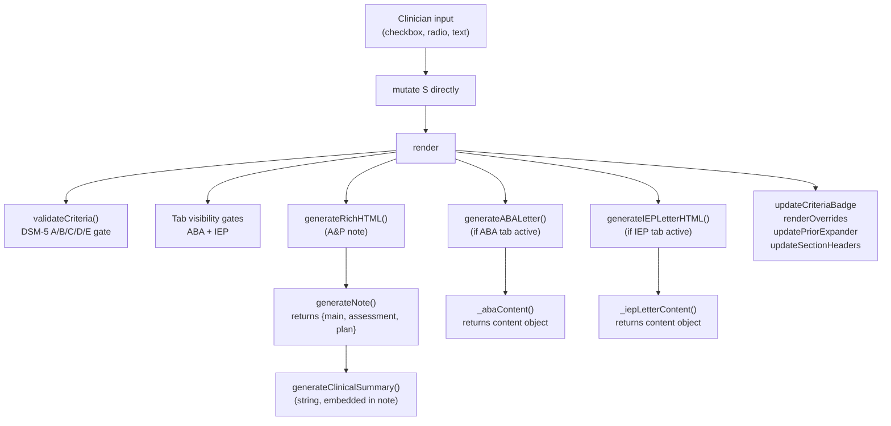
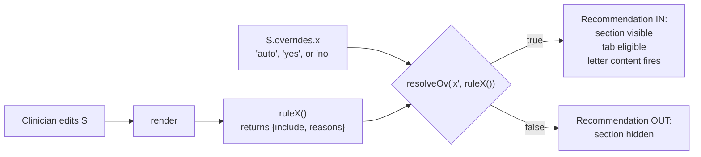

# Branching Logic Reference — autism-ap-builder.html

> **Living spec.** This document describes every output-shaping decision in `autism-ap-builder.html`. It is intended as a working reference for the maintainer (David) and future Claude Code sessions making changes to the app.
>
> **Last verified against commit:** `8f05033`
> **Source file:** [`autism-ap-builder.html`](../autism-ap-builder.html) (~4,938 lines)
> **Plain-English clinician companion:** a non-technical version of this content (same 12-section structure, vignettes instead of mechanism, no code or line refs) is planned at `docs/branching-logic-for-clinicians.html`. A working draft lives at `scratch/branching-logic-for-clinicians.html` in the interim. When changes here affect user-visible behavior, the clinician doc should be updated too — see its `§12 How this document is maintained` once migrated.

---

## How to read this doc

The app generates three pieces of clinical output — an **A&P note**, an **ABA letter**, and an **IEP letter** — by passing a single state object `S` through a render pipeline. Every variation a clinician sees in those outputs traces back to a branch on `S`. This doc catalogs those branches.

**Conventions used throughout:**

- `S.foo` — a property of the state object
- `S.foo.has('bar')` — `S.foo` is a `Set`, and we're checking membership
- File:line references like `autism-ap-builder.html:1234` point to the source for verification
- Diagrams use [Mermaid](https://mermaid.js.org/) (GitHub renders them inline)
- The `// WARY:` source-comment convention (described in §11) marks code the maintainer has flagged as fragile — relevant warnings are surfaced inline as **WARY:** callouts in the affected section
- **SC** = Social Communication; **RRB** = Restricted/Repetitive Behaviors (the DSM-5 two-domain split used throughout)

**Reading order by section:**

| Section | Type | Why it matters |
|---|---|---|
| [§1 State model & pipeline](#1-state-model--output-pipeline) | Map | Orientation; required for the rest |
| [§7 Therapy recommendations](#7-therapy-recommendations--override-system) | Cascade | Most consequential single mechanism in the app |
| [§9 ABA letter content](#9-aba-letter-content-rules) | Content rules | Highest historical bug density |
| [§4 DSM-5 criteria mapping](#4-dsm-5-criteria-mapping) | Decision table | Diagnostic gate |
| Others | Various | Read as needed for the area you're modifying |

---

## When to update this doc

Update **before merging** any change that touches:

- `render()`, `generateNote()`, `generateClinicalSummary()`, `_abaContent()`, `_iepLetterContent()`
- Any `rule*()` function (`ruleABA`, `rulePCIT`, etc.) or its conditions
- The `OV_DEFS` array or `resolveOv()`
- `syncABATargetsFromNeeds()`, `bridgeCogProfileToSpecifier()`
- The shape of `S` (added/removed/renamed properties)
- `getPron()`, `v3()`, `V3_MAP`, `aOr()`
- Any HTML control that adds/removes a value from a `Set` on `S`

After updating, bump the "Last verified against commit" line above and verify the change with the procedure in [§12 Maintenance protocol](#12-maintenance-protocol).

Functions documented here carry a `// keep docs/branching-logic.md in sync` comment near their definition as a reminder.

---

## 1. State model & output pipeline

The whole app is a single render loop over one state object `S`. There are no React components, no Redux store, no virtual DOM — every clinician input mutates `S` in place, then `render()` is called and rebuilds the visible output from scratch. The simplicity is the point: there is exactly one source of truth, and tracing a bug means tracing a property on `S` through the render pipeline.

### 1.1 Render pipeline



The two letter generators each have a `*Plain()` sibling (`generateABALetterPlain()`, `generateIEPLetterPlain()`) that produces a copy-friendly plain-text version from the same content object — so when modifying letter content, edit the `_*Content()` builder and both renderings update.

### 1.2 The `S` object — property reference

`S` is initialized once (`autism-ap-builder.html:1200`) and never reassigned. Properties fall into a few categories:

**Demographics & visit:**

| Property | Type | Values | Drives |
|---|---|---|---|
| `ageGroup` | string | `'toddler' \| 'preschool' \| 'schoolAge' \| 'adolescent' \| 'youngAdult'` | §2 (age-group routing) |
| `pronouns` | string | `'he' \| 'she' \| 'they' \| ''` | §8 (pronoun resolution) |
| `visitType` | string | varies | Note framing, RTC interval |
| `rtcInterval` | string | varies | Plan section |
| `diagStatus` | string | `'confirmed' \| 'suspected' \| 'ruleOut'` | §4, §5 (tab gates), §9 (ABA gate) |
| `insuranceType` | string | varies | ABA letter framing |

**Cognitive & adaptive profile:**

| Property | Type | Drives |
|---|---|---|
| `cogProfile` | string | Triggers `bridgeCogProfileToSpecifier()` → adds/removes specifiers; influences §3 (severity context), §9 (ABA target auto-add), §10 (IEP `accomIDMod`) |
| `cogDataSource` | string | Distinguishes confirmed vs suspected ID/GDD pathway. Value space (`comprehensive` / `screener` / `clinical` / `priorExternal`) is fixed; **visible labels are tier-conditional** — ID-tier shows IQ instruments (WISC, DAS, SB, WPPSI / KBIT-2R, RIAS-2, WASI-II), GDD-tier shows developmental instruments on the comprehensive line (Bayley-4, Mullen, Griffiths, DAYC-2) and a mix on the screener line (ASQ-3, SWYC, DAYC-2 Screener; **or KBIT-2R if age 4+**, since KBIT-2R is normed 4+ and is commonly encountered on preschoolers despite being an IQ screener rather than a developmental tool — the floor-effect warning at §11.6 fires for this case and distinguishes the preliminary-nature concern (all screeners) from the floor-effect concern (IQ screeners specifically)). `cogSourceSupportsConfirmation()` treats any `comprehensive` or `priorExternal` selection as confirmable regardless of which label is showing. Cleared on cogProfile ID↔GDD tier transition to prevent stale-label-matched-selection states. |
| `adaptProfile` | string | Adaptive functioning narrative |
| `adaptiveStandardized` | boolean | Gate for ID-confirmation strength |
| `unevenCog` + `unevenCogDesc` | boolean + string | Note prose for scatter |
| `strengths` | string | Plan section, IEP letter |
| `langLevel` | string | §6 indirectly; SLP rule indirectly |

**ASD severity (two-domain):**

| Property | Type | Drives |
|---|---|---|
| `asdLevelSC` | `'' \| '1' \| '2' \| '3'` | §3, ABA Level 2/3 trigger in `ruleABA` |
| `asdLevelRRB` | `'' \| '1' \| '2' \| '3'` | §3, ABA Level 2/3 trigger |
| `asdLevelJustificationSC` | string | Note prose only |
| `asdLevelJustificationRRB` | string | Note prose only |

**DSM-5 criteria (Sets):**

| Property | Members | Drives |
|---|---|---|
| `criteriaA` | subset of `{a1, a2, a3}` | §4 — all 3 required for complete |
| `criteriaB` | subset of `{b1, b2, b3, b4}` | §4 — ≥2 required; `b2` auto-cascades to `needsBehavior.add('rigidity')` |
| `criteriaC` / `D` / `E` | boolean each | §4 — all must be true for complete |
| `ev` | object mapping criterion key → evidence string | Prose for criterion bullets |

**Needs categories (Sets, all add-only via UI):**

| Property | Drives |
|---|---|
| `needsComm` | §6 (SLP rule), §9 (functional_comm target), §10 (`slp_school` service) |
| `needsBehavior` | §7 (ABA, PCIT rules), §9 (multiple targets), §10 (FBA, BSP accommodations) |
| `needsAdaptive` | §7 (OT rule), §9 (self_help, safety_skills, menstrual_care targets) |
| `needsSensory` | §7 (OT rule), §10 (sensory accommodations) |
| `needsMotor` | §7 (OT/PT rules), §10 (PT services) |
| `needsSocial` | §7 (social skills, ABA rules), §10 (social skills service) |

**Safety & clinical flags (Sets and booleans):**

| Property | Drives |
|---|---|
| `safety` (Set) | §7 (ABA `safety.size > 0`), §9 (urgency clause) |
| `comorbid` (Set) | §6 in full |
| `comorbidInPlan` (Set) | Filters which comorbidities appear in the Plan section vs Assessment only |
| `specifiers` (Set) | DSM-5 specifier display; populated by `bridgeCogProfileToSpecifier()` |
| `seizureConcern` | §7 (EEG, neurology) |
| `focalNeuroFindings` | §7 (neurology, genetics) |
| `neurologyNowForSeizure` | Neurology urgency framing |
| `sleepStudy` | §7 (sleep_ref) |
| `dysmorphism` | §7 (genetics) |
| `congenitalAnomalies` | §7 (genetics) |
| `developmentalRegression` + `regressionTiming` | §7 (genetics, neurology) |

**Therapy & education status:**

| Property | Drives |
|---|---|
| `therapyStatus` | object `{slp, ot, aba, pt}` — current status displayed in plan |
| `behavFreq` | object `{tantrums, noncompliance, property, vocalDisruption, emotionalReg}` — informs severity language |
| `schoolPlacement` | string — IEP letter framing |
| `schoolDoc` | string — §5 (IEP tab gate) |
| `schoolSvc` (Set) | §10 — service block selection |
| `schoolSvcAuto` / `schoolSvcManualOff` | Sets — tracks which services were auto-recommended vs manually toggled off |
| `priorTesting` (Set) | Instrument names with `priorTestingOutcome[k]` and `priorTestingDate[k]` — cited in letters |
| `teacherMaterials` (Set) | School-supplied artifacts that informed assessment |

**ABA-specific:**

| Property | Drives |
|---|---|
| `abaTargets` (Set) | §9 — populated by `syncABATargetsFromNeeds()` |
| `abaSetting` (Set) | §9 — letter "settings" paragraph |
| `abaHours` | string — letter dosing line |

**Overrides:**

| Property | Drives |
|---|---|
| `overrides` | object, one key per rule; values `'auto' \| 'yes' \| 'no'`. See §7 |

**UI / preview:**

| Property | Drives |
|---|---|
| `previewMode` | `'note' \| 'aba' \| 'iep'` — which tab is active |
| `traumaIncludeInIEP` | boolean — opt-in gate for disclosing trauma in the IEP letter (default `false` to protect educational record) |

The full property list is intentionally exhaustive — it doubles as a checklist when adding a new branch ("is the field I'm adding really new, or is there already a Set I should reuse?").

### 1.3 Where state values originate (plumbing reference)

This doc primarily describes how state on `S` shapes output. When you need to **add a new value** to a Set (a new comorbidity, a new override key, a new age group, a new ABA target), you also need to know where the value is defined and how the UI puts it into `S`. The plumbing varies by category:

| Value type | UI control | JS wiring |
|---|---|---|
| Comorbidity key (e.g., `'anxiety'`) | Checkbox in the Clinical Formulation section of the HTML form; `value` attribute = the key | Event listener writes `S.comorbid.add(value)` / `delete(value)` on change. ICD-10 codes and prose live in the per-comorbid cases inside `_iepLetterContent()` (§10) and the A&P note generator |
| Override key | Defined as a row in `OV_DEFS` array (`autism-ap-builder.html:3996–4005`); paired with a corresponding `rule*()` function | `renderOverrides()` reads `OV_DEFS` to render the pill UI; `cycleOverride()` / `setOverride()` write to `S.overrides[key]` |
| Age group | Radio button in the HTML form; `value` attribute = one of the five strings | Direct `S.ageGroup = value` on change |
| Needs-category key (e.g., `'rigidity'` in `needsBehavior`) | Checkbox in the relevant Needs section; `value` = key | Direct Set mutation on change |
| ABA target key | Checkbox in the ABA section of the form; auto-populated by `syncABATargetsFromNeeds()` (§9.2) and manually toggleable by clinician | Set mutation; sync function runs on every state change |
| Specifier key | Largely populated by `bridgeCogProfileToSpecifier()` (§12 / Architecture section in CLAUDE.md), with some manual checkboxes | Bridge function runs on cogProfile / cogDataSource / adaptiveStandardized changes |
| Criterion (e.g., `'a1'`, `'b2'`) | Checkbox in DSM-5 criteria section | Direct Set mutation. `b2` toggle additionally invokes the rigidity cascade (§4.4) |

**Pattern for adding a new comorbidity (worked checklist):**

1. Add a checkbox to the HTML form's Clinical Formulation section with `value="newKey"`
2. Confirm the checkbox event handler writes to `S.comorbid` (the generic handler should cover this — verify by reading the listener registration)
3. Add the key + ICD code to the per-comorbid mapping inside `_iepLetterContent()` (look for the comorbidity-phrase loop near line 3362)
4. Add a row to the A&P note's co-occurring conditions builder
5. If the comorbidity should fire a therapy rule, add the trigger condition inside the relevant `rule*()` (e.g., add `S.comorbid.has('newKey')` to `rulePsychiatry`'s OR-chain)
6. If it warrants IEP-letter accommodations, add an entry to the `accomBeh` table (§10.6) via the per-comorbid switch
7. Update [§6.1 reference table](#61-comorbidity-reference-table) in this doc
8. Bump the "Last verified against commit" SHA

### 1.4 Alphabetical property index

For Ctrl-F navigation when you remember a property name but not its category:

| Property | Type | See |
|---|---|---|
| `abaHours` | string | [§1.2](#12-the-s-object--property-reference), [§9.6](#96-settings-and-hours) |
| `abaSetting` | Set | [§9.6](#96-settings-and-hours) |
| `abaTargets` | Set | [§9.2](#92-aba-target-population--syncabatargetsfromneeds) |
| `adaptiveStandardized` | boolean | [§1.2](#12-the-s-object--property-reference) |
| `adaptProfile` | string | [§1.2](#12-the-s-object--property-reference) |
| `ag` | Set | [§1.2](#12-the-s-object--property-reference) |
| `ageGroup` | string | [§2](#2-age-group-routing) |
| `asdLevelRRB` | string | [§3](#3-asd-severity-two-domain-model) |
| `asdLevelSC` | string | [§3](#3-asd-severity-two-domain-model) |
| `asdLevelJustificationRRB` | string | [§3](#3-asd-severity-two-domain-model) |
| `asdLevelJustificationSC` | string | [§3](#3-asd-severity-two-domain-model) |
| `behavFreq` | object | [§1.2](#12-the-s-object--property-reference), [§9.2](#92-aba-target-population--syncabatargetsfromneeds) |
| `cogDataSource` | string | [§1.2](#12-the-s-object--property-reference) |
| `cogProfile` | string | [§1.2](#12-the-s-object--property-reference), [§9.2](#92-aba-target-population--syncabatargetsfromneeds) |
| `comorbid` | Set | [§6](#6-comorbidity-cascade) |
| `comorbidInPlan` | Set | [§6](#6-comorbidity-cascade) |
| `congenitalAnomalies` | boolean | [§1.2](#12-the-s-object--property-reference) |
| `criteriaA` | Set | [§4](#4-dsm-5-criteria-mapping) |
| `criteriaB` | Set | [§4](#4-dsm-5-criteria-mapping) |
| `criteriaC` / `criteriaD` / `criteriaE` | boolean | [§4](#4-dsm-5-criteria-mapping) |
| `developmentalRegression` | boolean | [§1.2](#12-the-s-object--property-reference) |
| `diagStatus` | string | [§4.5](#45-confirmed-vs-suspected-diagnosis-paths), [§5.2](#52-the-aba-hard-gate) |
| `dxEvalPath` | string | [§1.2](#12-the-s-object--property-reference) |
| `dysmorphism` | boolean | [§1.2](#12-the-s-object--property-reference) |
| `ev` | object | [§4](#4-dsm-5-criteria-mapping) |
| `focalNeuroFindings` | boolean | [§1.2](#12-the-s-object--property-reference) |
| `insuranceType` | string | [§1.2](#12-the-s-object--property-reference) |
| `langLevel` | string | [§1.2](#12-the-s-object--property-reference) |
| `needsAdaptive` | Set | [§1.2](#12-the-s-object--property-reference) |
| `needsBehavior` | Set | [§9.2](#92-aba-target-population--syncabatargetsfromneeds), [§4.4](#44-side-effects-of-specific-criteria) |
| `needsComm` | Set | [§1.2](#12-the-s-object--property-reference) |
| `needsMotor` | Set | [§1.2](#12-the-s-object--property-reference) |
| `needsSensory` | Set | [§1.2](#12-the-s-object--property-reference) |
| `needsSocial` | Set | [§1.2](#12-the-s-object--property-reference) |
| `neurologyNowForSeizure` | boolean | [§1.2](#12-the-s-object--property-reference) |
| `overrides` | object | [§7](#7-therapy-recommendations--override-system) |
| `previewMode` | string | [§5.4](#54-fallback-behavior) |
| `priorTesting` | Set | [§1.2](#12-the-s-object--property-reference) |
| `pronouns` | string | [§8](#8-pronoun--verb-agreement) |
| `regressionTiming` | string | [§1.2](#12-the-s-object--property-reference) |
| `rtcInterval` | string | [§1.2](#12-the-s-object--property-reference) |
| `safety` | Set | [§9.5](#95-safety-urgency-clause), [§7.2](#72-the-18-rules-at-a-glance) |
| `schoolDoc` | string | [§5.3](#53-the-iep-hard-gates) |
| `schoolPlacement` | string | [§1.2](#12-the-s-object--property-reference) |
| `schoolSvc` | Set | [§10.5](#105-service-rationale-blocks) |
| `schoolSvcAuto` / `schoolSvcManualOff` | Set | [§10.8](#108-the-schoolsvcauto--schoolsvcmanualoff-tracking) |
| `seizureConcern` | boolean | [§7.2](#72-the-18-rules-at-a-glance) |
| `sleepStudy` | boolean | [§7.2](#72-the-18-rules-at-a-glance) |
| `specifiers` | Set | [§9.7](#97-specifier-display--intentional-omissions), [§10.7](#107-specifier-edge-cases) |
| `strengths` | string | [§1.2](#12-the-s-object--property-reference) |
| `teacherMaterials` | Set | [§1.2](#12-the-s-object--property-reference) |
| `therapyStatus` | object | [§1.2](#12-the-s-object--property-reference) |
| `traumaIncludeInIEP` | boolean | [§6.4](#64-the-trauma-iep-gate), [§10.3](#103-trauma-opt-in-gate) |
| `unevenCog` / `unevenCogDesc` | boolean / string | [§1.2](#12-the-s-object--property-reference) |
| `visitType` | string | [§1.2](#12-the-s-object--property-reference) |

---

## 2. Age-group routing

`S.ageGroup` is the most widely-consulted property in the app — more than fifteen distinct output branches read it. The five values map to clinical-developmental windows, not strict age ranges, but the tool labels them with conventional ages for clinician convenience:

| Value | Convention | Why this break exists |
|---|---|---|
| `'toddler'` | 12–35 mo | Pre-Part C boundary; Early Steps eligibility; no IEP |
| `'preschool'` | 3–5 y | FDLRS / pre-K services; NDBI is appropriate |
| `'schoolAge'` | 6–11 y | School-based services; FBA-based ABA framing |
| `'adolescent'` | 12–17 y | Self-advocacy, consent education, vocational pre-planning |
| `'youngAdult'` | 18+ y | Adult workplace framing; legal-consequence awareness |

### 2.1 Content branches by age group

The branches below all read `S.ageGroup` directly or via a helper like `isYoung()` (toddler or preschool) or `isOlderForABA()` (adolescent or young adult).

| Branch | Line | Condition | Effect |
|---|---|---|---|
| IEP tab visibility | 3938 | `ageGroup !== 'toddler'` (plus `schoolDoc !== ''`) | Hide IEP tab for toddlers |
| NDBI vs FBA prose in ABA letter | 2067–2068 | `isYoung()` → NDBI; `'schoolAge'` → FBA | Letter language shifts |
| Cognitive-profile tier age gates | 4494, 4505, 4517 | `young` hides ID tier + BIF radios; `older` hides GDD tier | DSM-5/AACAP: ID/BIF require IQ testing (unreliable <5); GDD doesn't apply ≥5. Teardown clears `cogProfile` and calls `bridgeCogProfileToSpecifier('')` to drop the matching specifier |
| Adolescent/adult safety targets | 2099 | `['adolescent','youngAdult'].includes(ageGroup)` | Add consent education + legal awareness to safety targets |
| ABA modality emphasis | 2105 | `['schoolAge','adolescent','youngAdult'].includes(ageGroup)` | NET primary, DTT only for initial acquisition |
| Self-advocacy in psychotherapy goals | 2125 | adolescent/youngAdult | Integrates self-determination language |
| KBIT-2R cognitive screening recommendation | 1883–1884 | `≥ preschool` | Recommend if no prior cognitive testing |
| `'academics'` ABA target gating | 4557 | `S.academic && isYoung()` | Toddler/preschool only — school-age academics are IDEA/FAPE territory; including in ABA letter risks claim denial |
| EIBI / Cochrane reference | 3203 | `isYoung()` | Added to ABA letter evidence section |
| Social skills group rule | 1377 | `['preschool','schoolAge','adolescent'].includes(ageGroup)` | Toddlers excluded (developmental fit); young adults excluded (use psychotherapy instead) |
| FDLRS rule (Florida pre-K) | 1430 | `'preschool'` AND not in public school | FDLRS referral |
| Early Steps rule | 1426 | `'toddler'` | Part C referral |
| Audiology — speech-driven | 1419–1420 | `isYoung() && speechConcern` | Audiology fires; older children assumed already screened |
| QbTest age gate | 1424 | `['schoolAge','adolescent','youngAdult'].includes(ageGroup)` | Excludes toddler/preschool (instrument norms start at 6) |
| ABA target labels | 3149–3155 | `isOlderForABA()` | "play skills" → "social-pragmatic skills for workplace"; "self-help" → "independent living" |
| Visual schedule format in IEP | 3559–3560 | Calibrated to age | Pictorial for young/non-reading; written for verbal/older |

### 2.2 Pronoun fallback by age

When `S.pronouns` is `''` (unspecified), `getPron()` falls back to a noun phrase that depends on age (see [§8](#8-pronoun--verb-agreement)):

- `adolescent` / `youngAdult` → `"the individual"`
- All others → `"the child"`

### 2.3 What does *not* depend on `ageGroup`

Worth knowing — these look like they should be age-gated but aren't:

- DSM-5 criteria counts (§4) — diagnostic gates are age-independent
- ASD severity levels (§3) — Level 1/2/3 descriptions apply across ages
- The comorbidity Set (§6) — every comorbidity rule fires regardless of age (downstream service rules may then gate on age)
- The `safety` Set effects in the ABA letter urgency clause (§9.4)

If you find yourself wanting to add an age gate to one of the above, double-check the clinical rationale — these were deliberately kept age-agnostic.

---

## 3. ASD severity (two-domain model)

DSM-5 specifies ASD severity **per domain** — a patient can require Level 2 support for social communication and Level 1 for restricted/repetitive behaviors, and the diagnostic write-up must say so explicitly. The app enforces this by exposing two independent severity fields and **never collapsing them into a single `asdLevel`**.

### 3.1 The two fields

| Property | Values | Domain |
|---|---|---|
| `S.asdLevelSC` | `'' \| '1' \| '2' \| '3'` | Social Communication |
| `S.asdLevelRRB` | `'' \| '1' \| '2' \| '3'` | Restricted/Repetitive Behaviors |
| `S.asdLevelJustificationSC` | free text | Clinician note for SC level |
| `S.asdLevelJustificationRRB` | free text | Clinician note for RRB level |

There is **no `S.asdLevel`**. Searching for one means the code reading it is wrong.

### 3.2 The combined-level rule

Several output contexts need a single representative level — the ABA letter's overall medical-necessity paragraph, the IEP letter's label line, the badge in the form's header. The derivation is the same in all three places (`autism-ap-builder.html:1467`, `:3099`, `:3349`):

```javascript
const asdLevelKey = (S.asdLevelSC && S.asdLevelRRB)
  ? String(Math.max(parseInt(S.asdLevelSC), parseInt(S.asdLevelRRB)))
  : S.asdLevelSC || S.asdLevelRRB || '';
```

Read it as:
- **Both set** → take the higher (more severe) of the two
- **Only one set** → use that one
- **Neither set** → empty string (downstream code shows `"(level not specified)"` fallback)

The "take the higher" rule is intentional and clinically conservative: a patient at Level 2 RRB and Level 1 SC gets the Level 2 narrative in their ABA medical-necessity letter, supporting the higher-intensity authorization their RRB severity justifies.

### 3.3 Where the combined level surfaces

| Use site | Line | Content driven |
|---|---|---|
| Header badge ring chart | 1467 | Visual summary of combined level |
| ABA letter — narrative | 3091–3098 | Level-specific paragraph from `levelData[asdLevelKey]` |
| ABA letter — diagnosis line | 3239 | "Level X (Requiring Substantial Support) — Social Communication and Restricted/Repetitive Behaviors" |
| IEP letter — severity classification | 3349 | "Level X (requiring substantial support)" label |

### 3.4 Where the per-domain levels surface

| Use site | Line | Reads |
|---|---|---|
| `asdLevel23()` helper (ABA trigger) | 1255 | `asdLevelSC >= '2' \|\| asdLevelRRB >= '2'` — fires `ruleABA`, `rulePCIT`, `rulePsychiatry` |
| A&P note severity paragraph | various | Both domain levels + justification text are printed separately |

### 3.5 LEVEL_LABELS and LEVEL_DESC

Defined at `autism-ap-builder.html:1452–1465`. These are display constants used in the note and both letters:

- **Level 1** — "requiring support"
- **Level 2** — "requiring substantial support"
- **Level 3** — "requiring very substantial support"

Each has separate description text for SC and RRB. If DSM updates the language, edit these constants — they're the single source of truth for the labels.

---

## 4. DSM-5 criteria mapping

DSM-5 requires five criteria for an ASD diagnosis: **all three** of Criterion A (social communication), **at least two** of Criterion B (restricted/repetitive behaviors), and three Boolean gates (C: symptom onset in early development; D: clinically significant functional impairment; E: not better explained by ID/GDD alone).

### 4.1 The fields

| Property | Type | Members / values |
|---|---|---|
| `S.criteriaA` | Set | subset of `{a1, a2, a3}` |
| `S.criteriaB` | Set | subset of `{b1, b2, b3, b4}` |
| `S.criteriaC` | boolean | symptom onset criterion |
| `S.criteriaD` | boolean | functional impairment criterion |
| `S.criteriaE` | boolean | differential criterion |
| `S.ev` | object | per-key evidence strings keyed `a1, a2, a3, b1, b2, b3, b4, c, d, e` |

### 4.2 The diagnostic gate

`validateCriteria()` at `autism-ap-builder.html:1443`:

```javascript
return {
  aCount: S.criteriaA.size,
  bCount: S.criteriaB.size,
  cde: S.criteriaC && S.criteriaD && S.criteriaE,
  complete: S.criteriaA.size === 3 && S.criteriaB.size >= 2 && cde
};
```

Decision table:

| `aCount` | `bCount` | `cde` | `complete` | Display |
|---|---|---|---|---|
| 3 | ≥2 | true | **true** | ✓ DSM-5 criteria complete |
| any other combination | | | **false** | Form proceeds, but if `diagStatus === 'confirmed'`, warning banner fires |

### 4.3 The "confirmed but incomplete" warning

If the clinician sets `diagStatus = 'confirmed'` but `validateCriteria()` returns `complete: false`, the form displays a warning banner showing what's missing (`autism-ap-builder.html:3966`). The banner format:

> ⚠ DSM-5 criteria incomplete — A: 2/3 · B: 1/4 · C/D/E: missing C

The warning is non-blocking — the clinician can still proceed (the tool serves cases where the clinician *intends* to document an exception). But the banner is intentionally prominent so an omission isn't accidental.

### 4.4 Side effects of specific criteria

A few criteria toggle other state when set, beyond their own membership:

| Trigger | Auto-side-effect | Line | Rationale |
|---|---|---|---|
| Echolalic modifier chip clicked | `criteriaB.add('b1')`; pre-fills `ev.b1` with "Scripted/echolalic speech" | 4090–4098 | Echolalia is the textbook B1 finding; reduce data-entry burden |
| `criteriaB.has('b2')` becomes true | `needsBehavior.add('rigidity')`; via §9 cascade adds `'transitions'` ABA target | 4567, 4566 | B2 (insistence on sameness) is operationally the same as the "rigidity" needs category |
| `criteriaB.has('b2')` becomes false | `needsBehavior.delete('rigidity')` | 4538 | Reverses the above. This is the one **exception** to `syncABATargetsFromNeeds()`'s add-only design (§9) — rigidity is derived, not manually entered |

### 4.5 Confirmed vs suspected diagnosis paths

| `S.diagStatus` | Output behavior |
|---|---|
| `'confirmed'` | Note states diagnosis affirmatively. ABA tab eligible. CARD rule fires. |
| `'suspected'` | Note uses differential language ("Concerns consistent with ASD; differential includes..."). ABA tab hidden. Early Steps and FDLRS still fire. |
| `'ruleOut'` | Note documents the evaluation process and negative finding. Most therapy rules don't fire. |

The `diagStatus` field is the master gate for whether the app is documenting a diagnosis versus an evaluation — many other branches read it.

### 4.6 What criteria do *not* drive

- ASD severity levels (§3) are orthogonal to criteria — a patient can be Level 3 with 2/3 A and 2/4 B (which would block "complete," but the levels themselves are independent)
- The override system (§7) does not bypass criteria — even with all overrides on `'yes'`, an incomplete `validateCriteria()` still fires the warning banner

---

## 5. Output tab visibility

Three output tabs sit at the top of the right-hand panel. Their visibility is recomputed on every `render()`. When a tab disappears while the user was viewing it, the active tab falls back to the A&P note.

### 5.1 Tab gates

| Tab | DOM id | Gate | Line |
|---|---|---|---|
| A&P Note | `tabNote` | always visible | — |
| ABA Letter | `tabABA` | `abaIncluded && S.diagStatus === 'confirmed'` | 3928, 3932 |
| IEP Letter | `tabIEP` | `S.schoolDoc !== '' && S.ageGroup !== 'toddler'` | 3938–3940 |

Where `abaIncluded = resolveOv('aba', ruleABA())` — i.e., the same resolution layer described in [§7](#7-therapy-recommendations--override-system).

### 5.2 The ABA hard gate

The ABA letter requires `diagStatus === 'confirmed'`. There is no way to render the letter for a suspected diagnosis — the clinician would have to first confirm. This is intentional: the letter is a medical-necessity attestation, and writing one without a confirmed diagnosis would be clinically inappropriate. The override system can force `abaIncluded` to true, but it cannot bypass the diagnosis check.

### 5.3 The IEP hard gates

The IEP letter is hidden when:
- `schoolDoc === ''` (the clinician hasn't indicated whether/where the patient is enrolled) — no school context to write to
- `ageGroup === 'toddler'` — toddlers receive Part C (Early Steps) services, not IEPs (Part B starts at age 3); writing an IEP letter for a toddler would direct services to the wrong system

### 5.4 Fallback behavior

If a previously-active tab hides, `render()` switches to the A&P note tab automatically (`autism-ap-builder.html:3933–3935`, `:3941`):

```javascript
if (!abaIncluded || S.diagStatus !== 'confirmed') {
  if (S.previewMode === 'aba') {
    S.previewMode = 'note';
    setPreviewMode('note');
    return;
  }
}
```

This prevents a confusing state where the user is "on" a tab that no longer exists.

---

## 6. Comorbidity cascade

`S.comorbid` is a Set of comorbidity keys. Each key triggers up to three downstream consequences: (a) appearance in the A&P note's co-occurring conditions list with the appropriate ICD-10 code, (b) IEP-letter prose customized for educational impact, and (c) firing of therapy/referral rules from §7. The cascade is intentional — adding a comorbidity is a single click that produces a full coordinated documentation cascade.

A second Set, `S.comorbidInPlan`, filters which comorbidities appear in the Plan section's per-problem breakdown versus only in the Assessment list. This lets the clinician acknowledge a comorbidity without committing to a plan in this visit.

### 6.1 Comorbidity reference table

| Key | ICD-10 | A&P language | IEP language emphasis | Rules fired |
|---|---|---|---|---|
| `adhd_combined` | F90.2 | "ADHD, combined presentation" | Executive function / attention accommodations | `rulePsychiatry`, `ruleQBTest` |
| `adhd_inattentive` | F90.0 | "ADHD, predominantly inattentive" | Same as above | `rulePsychiatry`, `ruleQBTest` |
| `adhd_hyperactive` | F90.1 | "ADHD, predominantly hyperactive/impulsive" | Same as above | `rulePsychiatry`, `ruleQBTest` |
| `adhd_suspected` | Z03.89 | "ADHD, suspected — under evaluation" | "Pending ADHD evaluation" | `ruleQBTest`, conditional `rulePsychiatry` |
| `anxiety` | F41.x | "Anxiety disorder" | CBT recs, calm space, gradual exposure | `rulePsychiatry`, `rulePsychotherapy`, `rulePCIT` |
| `depression` | F32.x | "Depressive disorder" + suicide-risk note if `depressionSafety` set | Behavioral activation, mood-support accoms | `rulePsychiatry`, `rulePsychotherapy` |
| `ocd` | F42.x | "Obsessive-compulsive disorder" | ERP/CBT; ritual accommodation | `rulePsychiatry`, `rulePsychotherapy` |
| `trauma` | (clinical narrative) | Trauma-informed approach noted in A&P | **Gated by `traumaIncludeInIEP`** — default omitted from IEP letter to protect educational record | (referral to trauma-informed therapy) |
| `ld_reading` | F81.0 | "Specific learning disorder, reading (dyslexia)" | TTS, audiobooks, extended time | — |
| `ld_math` | F81.2 | "Specific learning disorder, mathematics" | Calculator, manipulatives, graph paper | — |
| `ld_written` | F81.81 | "Specific learning disorder, written expression" | Speech-to-text, keyboarding, extended time | — |
| `ld_suspected` | Z03.89 | "Suspected SLD — pending psychoed evaluation" | Interim extended time + chunking | — |
| `language_disorder` | F80.x | "Language disorder" (distinct from ASD pragmatics) | SLP services noted as required | `ruleSLP` |
| `dcd` | F82 | "Developmental Coordination Disorder" | Handwriting/fine motor focus, OT services | `ruleOT`, `rulePT` |
| `epilepsy` | G40.x | "Epilepsy / seizure disorder" | Seizure protocol, post-ictal accoms | `ruleNeurology` |
| `sleep_disorder` | G47.x | "Sleep disorder" | Fatigue accoms | `ruleSleepRef` (only if `sleepStudy` also set) |
| `arfid` | F50.82 | "ARFID" | Mealtime accoms (safe foods, no pressure) | `ruleGI` |
| `arfid_suspected` | Z03.89 | "ARFID (suspected) — eval pending" | (same, interim) | `ruleGI` |
| `pfd_acute` | R63.30 | "Pediatric Feeding Disorder, acute" | Feeding therapy coordination | `ruleGI` |
| `pfd_chronic` | R63.31 | "Pediatric Feeding Disorder, chronic" | Oral-motor / dysphagia protocols | `ruleGI` |
| `pfd_suspected` | Z03.89 | "PFD (suspected)" | (same, interim) | `ruleGI` |
| `gi` | various (K59 etc.) | "Gastrointestinal concerns" | GI/dietitian referral; behavioral feeding support | `ruleGI` |
| `catatonia` | F06.1 | Listed in specifiers + comorbidities | (clinical only) | — |
| `catatonia_history` | F06.1 (by history) | Listed in specifiers | (clinical only) | — |

### 6.2 Mutex and auto-population

| Rule | Line | Behavior |
|---|---|---|
| LD confirmed-domain ↔ `ld_suspected` mutex | 4764–4768 | Selecting any of `ld_reading/math/written` clears `ld_suspected` and vice versa — can't be both certain and uncertain |
| Echolalic chip → criterion B1 | 4090–4098 | Toggles `criteriaB.add('b1')` and pre-fills `ev.b1` |
| Trauma comorbid → IEP opt-in checkbox revealed | 4771 | Setting `comorbid.add('trauma')` reveals the `traumaIncludeInIEP` checkbox; default remains false |

### 6.3 Worked example — adding `adhd_combined` to a patient

Scenario: an 8-year-old patient already documented as confirmed ASD Level 1 (both domains), some social needs. Clinician checks the ADHD comorbidity box and selects "combined presentation."

**Step 1 — State mutation:**

```javascript
S.comorbid.add('adhd_combined');
```

**Step 2 — A&P note effects** (next `render()`):

The co-occurring conditions list now includes *"Attention-Deficit/Hyperactivity Disorder, combined presentation (ICD-10: F90.2)"*. If `comorbidInPlan.has('adhd_combined')`, a Problem-level breakdown appears in the Plan section.

**Step 3 — Therapy rules fire:**

- `rulePsychiatry()` (§7.2, line 1410): trigger condition `confirmed ADHD` is now satisfied → returns `{include: true, reasons: [..., 'confirmed ADHD']}`.
- `ruleQBTest()` (§7.2, line 1424): trigger condition `ADHD suspected/confirmed AND age ∈ {schoolAge, adolescent, youngAdult}` is now satisfied → returns `{include: true, ...}`.

Both rules feed through `resolveOv()` (§7.4). Assuming overrides are on `'auto'`, both recommendations now appear in the form's recommendation section.

**Step 4 — ABA letter** (if ABA is also included):

The medical-necessity paragraph's `reasons` array remains unchanged by adding ADHD — `ruleABA` doesn't read `comorbid`. But the functional impairment paragraph (§9.4) may pick up additional domain phrasing if behavior or other needs cascade from clinician follow-up.

**Step 5 — IEP letter** (if visible):

- Diagnosis label paragraph appends ADHD per §10.2.
- Educational impact bullets (§10.4) may add ADHD-specific framing.
- `accomBeh` (§10.6) adds: *extended time, preferential seating, chunked assignments*.

**Step 6 — Removing the comorbidity:**

Unchecking the box removes `'adhd_combined'` from `S.comorbid`. All effects reverse automatically — there is no "stickiness" for comorbidities the way there is for ABA targets. (Comorbidities are facts about the patient; targets are clinician judgments about what to work on.)

### 6.4 The trauma IEP gate

By default, trauma is documented in the medical chart (A&P note) but **not** in the IEP letter. The IEP letter goes into the educational record, which has different privacy and access properties than the medical record. The clinician must explicitly opt in by checking `traumaIncludeInIEP` for trauma to appear in the IEP letter, and a warning banner appears at the top of the IEP letter preview when this is enabled (`autism-ap-builder.html:3636–3638`).

---

## 7. Therapy recommendations & override system

This is the section most likely to need editing as clinical guidelines evolve. Every therapy and referral the tool can recommend goes through the same two-step pipeline: an **automatic rule** computes whether the recommendation *would* fire by default, then a per-recommendation **override** lets the clinician force it on, force it off, or accept the default. The output of that combined decision drives which sections are visible in the form, which tabs appear, and what content lands in the ABA / IEP letters.

### 7.1 The pipeline shape



Every recommendation follows this exact shape — there is no second mechanism. If you understand `ruleX()` and `resolveOv()`, you understand the whole therapy layer.

### 7.2 The 18 rules at a glance

| # | Rule | Line | Trigger (simplified) | Override key |
|---|---|---|---|---|
| 1 | `ruleABA` | 1347 | Fires if **any** of: (a) age toddler or preschool; (b) minimally verbal; (c) confirmed ID with `withID` specifier; (d) significant adaptive impairment; (e) `needsBehavior.size > 0`; (f) `safety.size > 0`; (g) ASD Level 2 or 3 in either domain | `aba` |
| 2 | `rulePCIT` | 1361 | Age ∈ {toddler, preschool, schoolAge} AND (behavior needs OR ADHD/anxiety/trauma) | `pcit` |
| 3 | `rulePsychotherapy` | 1370 | Age ∈ {schoolAge, adolescent, youngAdult} AND verbal AND (anxiety/depression/OCD/trauma/emotional reg/boundary) | `psychotherapy` |
| 4 | `ruleSocialSkills` | 1376 | Age ∈ {preschool, schoolAge, adolescent} AND not minimally verbal AND (social needs OR boundary) | `socialSkills` |
| 5 | `ruleSLP` | 1381 | Communication needs OR language disorder OR pragmatic/articulation/echolalic modifiers | `slp` |
| 6 | `ruleOT` | 1388 | Sensory needs OR fine motor needs OR adaptive needs OR DCD comorbid | `ot` |
| 7 | `rulePT` | 1389 | Gross motor needs OR DCD comorbid | `pt` |
| 8 | `ruleGenetics` | 1390 | Confirmed ASD, OR (diagStatus set AND (ID OR regression OR dysmorphism OR congenital anomaly OR focal neuro findings)) | `genetics` |
| 9 | `ruleNeurology` | 1409 | Epilepsy OR focal neuro findings OR seizure concern OR developmental regression | `neurology` |
| 10 | `rulePsychiatry` | 1410 | Confirmed ADHD/anxiety/depression/OCD, OR (severe behavior AND age school+) | `psychiatry` |
| 11 | `ruleGI` | 1415 | GI comorbid OR feeding OR PFD OR ARFID OR pica | `gi` |
| 12 | `ruleSleepRef` | 1416 | `S.sleepStudy === true` | `sleep_ref` |
| 13 | `ruleAudiology` | 1417 | Hearing screen fail, OR (toddler/preschool AND speech concern) | `audiology` |
| 14 | `ruleQBTest` | 1424 | ADHD suspected AND age ∈ {schoolAge, adolescent, youngAdult} | `qbtest` |
| 15 | `ruleEarlySteps` | 1426 | Age = toddler AND diagStatus ∈ {confirmed, suspected} | `earlySteps` |
| 16 | `ruleFDLRS` | 1429 | Age = preschool AND not in public school AND diagStatus ∈ {confirmed, suspected} | `fdlrs` |
| 17 | `ruleEEG` | 1434 | `S.seizureConcern === true` | `eeg` |
| 18 | `ruleCARD` | 1435 | `S.diagStatus === 'confirmed'` | `card` |

Each `rule*()` returns `{ include: boolean, reasons: string[] }`. The `reasons` array is consumed downstream by `_abaContent()` to compose the medical-necessity paragraph in the ABA letter — so adding a new trigger condition to `ruleABA` should also append a human-readable reason string.

### 7.3 Rules grouped by category

The 18 rules fall into four natural groups. Each group is documented here in terms of *what clinical signal it cares about* — the table above remains the source of truth for the exact conditions.

**Therapy services (1–7, 11):** What the patient should be doing weekly. ABA is gated on a mix of age, communication ability, and severity. PCIT covers early-childhood behavior-and-attachment work. Psychotherapy is reserved for verbal school-age and older with mental-health comorbidities. Social skills groups span preschool through adolescence but exclude minimally-verbal children (group format requires expressive language). SLP/OT/PT mirror their needs categories directly. GI is comorbidity-driven.

**Medical referrals (8–10, 12, 13, 17):** Specialist consultations the PCP should send. Genetics has the broadest trigger surface — any confirmed ASD plus any of several flags. Neurology and EEG both fire on seizure-adjacent findings but are independent rules (EEG can fire without neurology if `seizureConcern` is set in isolation, which is intentional — the EEG itself may resolve the question without a specialist referral). Audiology has a young-child speech-screen branch that's easy to miss.

**Screening / assessment (14):** Currently only QbTest. The age restriction (school-age+) reflects QbTest's normative range, not a clinical preference. If a future screening instrument is added (e.g., a structured anxiety scale), it would belong in this group.

**Florida-specific service navigation (15, 16, 18):** Early Steps is the Part C (0–35 mo) entry point. FDLRS catches preschoolers who aren't yet in the public school system. CARD (Center for Autism and Related Disabilities) is a confirmed-ASD-only resource. These are conditional on Florida geography being implicit — outside-FL clinicians using a future fork would need to disable or remap these.

### 7.4 `resolveOv()` resolution

The override resolver is intentionally tiny:

```javascript
function resolveOv(key, rule) {
  const v = S.overrides[key];
  return v === 'yes' ? true : v === 'no' ? false : rule.include;
}
```

Truth table:

| `S.overrides[key]` | `rule.include` | `resolveOv` returns | Meaning |
|---|---|---|---|
| `'auto'` (default) | `true` | `true` | Default fires, user agrees |
| `'auto'` (default) | `false` | `false` | Default suppresses, user agrees |
| `'yes'` | `true` | `true` | User force-on, redundant with rule |
| `'yes'` | `false` | `true` | User force-on, overriding rule |
| `'no'` | `true` | `false` | User force-off, overriding rule |
| `'no'` | `false` | `false` | User force-off, redundant with rule |

The "redundant" rows aren't dead UI — they're how the clinician records *intent* (e.g., explicitly saying "no, I considered ABA and decided against it for this patient" rather than passively accepting the default).

### 7.5 Override pill UI

Each rule gets a pill in the override panel. The pills are defined in the `OV_DEFS` array (`autism-ap-builder.html:3996–4005`):

```javascript
const OV_DEFS = [
  { key:'aba', label:'ABA', getRule: () => ruleABA() },
  { key:'pcit', label:'PCIT', getRule: () => rulePCIT() },
  // ... 16 more entries
];
```

Each pill cycles through three states when clicked (`cycleOverride(key)`, line 4037–4042):

```
auto  →  yes (force on)  →  no (force off)  →  auto  ...
```

Display states (CSS classes):

| State | Rule says | CSS class | Visual |
|---|---|---|---|
| `auto` | include | `auto-yes` | Soft blue background |
| `auto` | exclude | `auto-no` | Soft gray |
| `yes` | (any) | `ov-yes` | Saturated green — clinician explicitly forced on |
| `no` | (any) | `ov-no` | Dim gray — clinician explicitly suppressed |

The saturation difference between `auto-yes` (default fires) and `ov-yes` (clinician forced) is intentional: at a glance, the clinician can tell *which* recommendations came from the rules and which they overrode.

`setOverride(key, value)` is the imperative setter (used internally and exposed for tests); `cycleOverride(key)` is what the click handler calls.

### 7.6 Worked example — ABA end-to-end

Scenario: a 4-year-old patient with `S.ageGroup = 'preschool'`, behavior concerns (`S.needsBehavior` contains `'aggression'` and `'tantrums'`), confirmed ASD (`S.diagStatus = 'confirmed'`), ASD Level 2 in social-communication only. No override set yet.

**Step 1 — Rule fires** (`ruleABA`, line 1347):

`S.ageGroup === 'preschool'` matches → pushes `'preschool age group'` to reasons.
`S.needsBehavior.size > 0` matches → pushes `'behavioral support needs'`.
`asdLevel23()` returns true (SC = '2') → pushes `'ASD Level 2 or 3'`.

Result: `{ include: true, reasons: ['preschool age group', 'behavioral support needs', 'ASD Level 2 or 3'] }`

**Step 2 — Override resolves** (`render`, line 3928):

`S.overrides.aba === 'auto'` → `resolveOv` returns `rule.include` → `true`.

**Step 3 — Side effects within `render()`**:

- ABA section in the form is shown (line 3930).
- ABA tab becomes visible (gate: `abaIncluded && S.diagStatus === 'confirmed'` — both true). See [§5](#5-output-tab-visibility).
- `syncABATargetsFromNeeds()` runs and auto-adds targets keyed off the needs Sets — in this case `'reduce_aggression'`, `'reduce_tantrum'`. See [§9](#9-aba-letter-content-rules) for the full mapping.

**Step 4 — Letter content** (`_abaContent`, line 3084):

The `reasons` array surfaces as the medical-necessity paragraph: *"Applied Behavior Analysis is medically necessary given preschool age group, behavioral support needs, and ASD Level 2 or 3."*

Combined-level lookup picks Level 2 narrative (line 3091). Domain filter (line 3102) catches `needsBehavior.size > 0` → adds *"behavioral regulation"* to the functional-impairment paragraph.

**Step 5 — If the clinician clicks the ABA pill once**:

`S.overrides.aba` becomes `'yes'` → `resolveOv` returns `true` regardless of rule. No change in this scenario (already true). But: if the clinician had set ASD Level 1 only and no behavior needs, `ruleABA` would return `include: false`, the section would be hidden — clicking the pill to `'yes'` would force it on, the section would reappear, the letter would render with whatever reasons the rule still managed to produce (possibly an empty array, which the letter handles with a fallback paragraph).

### 7.7 Open questions

These are inconsistencies or vague thresholds surfaced during the source scan. They aren't bugs, but a future reader changing this code should know about them:

1. **`rulePsychiatry` "severe behavior" is undefined in code** (line 1410). The condition reads roughly as `(confirmed ADHD/anxiety/depression/OCD) || (severeBehavior && ageSchoolPlus)` but "severe" isn't a state field — it's inferred from the size or specific contents of `needsBehavior` / `safety`. Worth a future audit pass to make the threshold explicit.

2. **Safety-flag asymmetry between `ruleABA` and `_abaContent`.** `ruleABA` checks `S.safety.size > 0` (line 1356), but the urgency-clause safety flags inside `_abaContent` (lines 3120–3125) are computed from a *different* set of conditions (`hasSIB`, `hasElope`, etc., which combine `needsBehavior` membership with specific `safety` keys). The two lists overlap but aren't identical. A patient could trip `ruleABA` for "safety needs" while the letter's urgency clause stays silent, or vice versa. Probably fine clinically (the letter still mentions safety in the domain list), but worth verifying with a council pass before any refactor.

3. **No documented contract for what `reasons` strings should look like.** They're free-form English. `_abaContent` concatenates them with commas; a future rule author who pushes a sentence-cased string with a trailing period will produce ungrammatical letter output.

---

## 8. Pronoun & verb agreement

Clinical prose generators have to handle three pronoun cases (`he`, `she`, singular `they`) plus a noun-phrase fallback. The handling is a quiet correctness frontier — singular `they` takes plural verb forms, which English doesn't otherwise mark, and a missed conjugation produces "they has" instead of "they have." The fix is a small set of helper functions every prose generator must use.

### 8.1 `getPron()` — pronoun resolution

`autism-ap-builder.html:1267–1276`:

```javascript
function getPron() {
  const m = {
    he:   {subj:'he',   obj:'him',  poss:'his',   refl:'himself',   cap:'He'},
    she:  {subj:'she',  obj:'her',  poss:'her',   refl:'herself',   cap:'She'},
    they: {subj:'they', obj:'them', poss:'their', refl:'themselves', cap:'They'}
  };
  if (m[S.pronouns]) return m[S.pronouns];
  // Fallback for unspecified
  const n = ['adolescent','youngAdult'].includes(S.ageGroup) ? 'the individual' : 'the child';
  return { subj:n, obj:n, poss:n+"'s", refl:n+'self', cap:n[0].toUpperCase()+n.slice(1) };
}
```

| `S.pronouns` | `S.ageGroup` | `subj` | `cap` | `poss` |
|---|---|---|---|---|
| `'he'` | any | `he` | `He` | `his` |
| `'she'` | any | `she` | `She` | `her` |
| `'they'` | any | `they` | `They` | `their` |
| `''` | adolescent/youngAdult | `the individual` | `The individual` | `the individual's` |
| `''` | other | `the child` | `The child` | `the child's` |

The `cap` field is the sentence-opening capitalized form. Callers use it at sentence starts and `subj` mid-sentence.

### 8.2 `v3()` — verb conjugation for singular `they`

`autism-ap-builder.html:1303–1312`:

```javascript
function v3(w) {
  if (S.pronouns !== 'they') return w;
  if (!(w in V3_MAP)) console.warn('v3(): verb "' + w + '" not in V3_MAP...');
  return V3_MAP[w] || w;
}
```

Use it like: ``${pr.cap} ${v3('demonstrates')} ...`` → "He demonstrates..." or "They demonstrate..." (he/she/it 3rd-person singular form for he/she, bare form for they).

**`V3_MAP` entries (`autism-ap-builder.html:1296–1302`):**

| Singular | Bare (`they` form) |
|---|---|
| is | are |
| has | have |
| was | were |
| does | do |
| presents | present |
| carries | carry |
| demonstrates | demonstrate |
| shows | show |
| exhibits | exhibit |
| meets | meet |
| experiences | experience |
| engages | engage |
| communicates | communicate |
| uses | use |

**Adding new verbs:** edit `V3_MAP` directly, then grep the codebase for the new verb and wrap each `getPron()`-derived call with `v3()`. There is no automated check.

### 8.3 `aOr()` — article elision

`autism-ap-builder.html:1316`:

```javascript
function aOr(n) { return /^[aeiouAEIOU]/.test((n||'').trim()) ? 'an '+n : 'a '+n; }
```

`aOr('adolescent')` → `"an adolescent"`; `aOr('toddler')` → `"a toddler"`.

This is a first-letter heuristic and **does not** correctly handle silent-h words (`"an hour"`) or u-sounds-like-y (`"a unicorn"`). Both are rare in clinical prose; flag in code review if either ever appears in generated output.

### 8.4 WARY: silent fallback risk in `v3()`

`autism-ap-builder.html:1305` carries a `// WARY:` comment. The risk is structural:

> A new prose generator added by a future contributor — or by a code-generating tool — may use a verb not in `V3_MAP`. The `console.warn` fires, but clinicians don't open the browser console. The patient with `pronouns: 'they'` will see ungrammatical text in their note ("they has," "they presents"), and nobody will know unless the clinician spots it.

**Mitigations currently in place:**

1. The `// WARY:` comment marks the silent-fallback line so a code reviewer notices it
2. `docs/audits/verb-agreement.md` (per CLAUDE.md) documents an audit procedure to run when prose content is added
3. The console warning at least flags the issue during dev/testing

**Mitigations not in place but worth considering:**

- A startup-time scan of all prose-generating functions for finite verbs not in `V3_MAP` (would catch new generators)
- A visible-in-UI warning when `pronouns === 'they'` and any prose generator hits an unmapped verb (would catch missed wraps)

### 8.5 Verb agreement audit procedure

Per CLAUDE.md, when prose content is added or modified:

1. Set `S.pronouns = 'they'` in a manual test
2. Set every other state field that could trigger prose generation
3. Read the generated A&P note, ABA letter, and IEP letter
4. Watch for any verb following `they` that ends in `-s` — that's the bug pattern
5. Wrap the missing verb's call with `v3()` and add it to `V3_MAP` if needed

The procedure is in [docs/audits/verb-agreement.md](audits/verb-agreement.md).

---

## 9. ABA letter content rules

The ABA letter is the highest-stakes piece of generated content — it serves as a medical-necessity attestation that insurers use to authorize Applied Behavior Analysis services, often at 20–40+ hours per week. Errors of *over-inclusion* dilute clinical credibility; errors of *under-inclusion* result in service denials. This section documents every branch that shapes the letter's content.

The whole letter is built by `_abaContent()` (`autism-ap-builder.html:3084`), which returns a structured object consumed by both `generateABALetter()` (HTML) and `generateABALetterPlain()` (text for copy).

### 9.1 Hard gate — confirmed diagnosis only

`autism-ap-builder.html:3228–3229`:

```javascript
function generateABALetter(isPreview = false) {
  if (S.diagStatus !== 'confirmed') {
    return isPreview ? '<div...>ABA Letter requires confirmed ASD</div>' : '';
  }
  ...
}
```

The letter does not render for suspected or rule-out evaluations, regardless of override state. See [§5.2](#52-the-aba-hard-gate) for the tab-visibility implications.

### 9.2 ABA target population — `syncABATargetsFromNeeds()`

`syncABATargetsFromNeeds()` (called on every state change at lines 4685, 4687) is the engine that populates `S.abaTargets` from the rest of state.

**Add-only design.** Each candidate target is checked against the current `abaTargets` Set; if already present, the function skips it. If absent and the trigger condition holds, it adds. **There is no removal logic** — once a target is in the Set (either by sync or by the clinician manually checking it), it stays until the clinician manually unchecks. This is intentional and documented inline (`autism-ap-builder.html:4537`).

**Why add-only?** When a clinician curates the target list (perhaps removing a target the sync added because it doesn't apply to this patient's specific situation), reopening a needs checkbox that originally triggered the target should *not* silently resurrect it. The clinician's curation reflects judgment the sync function cannot replicate. The trade-off: a clinician who *wants* to reset has to manually uncheck each unwanted target.

**The one exception — rigidity** (`autism-ap-builder.html:4538`):

```javascript
if (!S.criteriaB.has('b2')) S.needsBehavior.delete('rigidity');
```

If `criteriaB.has('b2')` becomes false, `'rigidity'` is removed from `needsBehavior` (which in turn removes the `'transitions'` ABA target). The exception exists because rigidity is *derived* from B2 rather than manually entered — the clinician toggled B2, not the rigidity needs box.

**Target population table** (`autism-ap-builder.html:4545–4574`):

| Target | Auto-added when |
|---|---|
| `reduce_elopement` | `needsBehavior.has('elopement') \|\| safety.has('elopement_counsel')` |
| `reduce_sib` | `needsBehavior.has('sib') \|\| safety.has('sib_safety_counsel')` |
| `reduce_aggression` | `needsBehavior.has('aggression') \|\| needsBehavior.has('property')` |
| `reduce_tantrum` | `needsBehavior.has('tantrums') \|\| S.behavFreq.emotionalReg === true` |
| `play` | `needsSocial.has('play') \|\| needsSocial.has('peer')` |
| `functional_comm` | `needsComm.has('expressive') \|\| needsComm.has('receptive') \|\| needsComm.has('functional_aac')` |
| `safety_skills` | `needsAdaptive.has('commSafety') \|\| needsAdaptive.has('commIndependence')` |
| `menstrual_care` | `needsAdaptive.has('menstrualCare')` |
| `academics` | `S.academic === true && isYoung()` — **toddler/preschool only** (school-age academics belong to IDEA/FAPE, not ABA) |
| `joint_attention` + `imitation` | `isYoung() && (needsSocial.size > 0 \|\| needsComm.size > 0)` |
| `reduce_stereotypy` | `criteriaB.has('b1') \|\| needsBehavior.size > 0 \|\| needsBehavior.has('vocalDisruption')` |
| `reduce_pica` | `needsBehavior.has('pica')` |
| `boundary_skills` | `needsBehavior.has('boundaryViol')` |
| `transitions` | `criteriaB.has('b2')` (and `'rigidity'` added to needsBehavior). **Remove direction:** if `b2` becomes false, `'rigidity'` is deleted from `needsBehavior` (the one exception to add-only — see [§4.4](#44-side-effects-of-specific-criteria)), but `'transitions'` itself **stays** in `abaTargets` — the add-only contract still applies to the target. Clinician must manually uncheck if they want it gone. |
| `self_reg` | `S.behavFreq.emotionalReg === true` |
| `self_help` | Either path adds it once (Set semantics — no duplication): `needsAdaptive.has('toileting' \| 'dressing' \| 'feeding_adl')` **OR** `cogProfile === 'id_severe' \| 'id_moderate'` |

### 9.3 Level-based justification narrative

`autism-ap-builder.html:3091–3100`:

```javascript
const levelData = {
  '1': ['Level 1 — Requiring Support', 'narrative for L1...'],
  '2': ['Level 2 — Requiring Substantial Support', 'narrative for L2...'],
  '3': ['Level 3 — Requiring Very Substantial Support', 'narrative for L3...']
};
const asdLevelKey = (S.asdLevelSC && S.asdLevelRRB)
  ? String(Math.max(...))
  : S.asdLevelSC || S.asdLevelRRB || '';
const [levelLabel, levelText] = levelData[asdLevelKey]
  || ['(level not specified)', 'ABA is medically necessary...'];
```

If no level is set, the letter shows `"(level not specified)"` and falls back to generic ABA-necessity language. The level paragraph drives the bulk of the medical-necessity justification.

### 9.4 Functional-impairment paragraph — domain filtering

`autism-ap-builder.html:3102–3118`:

```javascript
const domainPairs = [
  [S.needsComm.size > 0, 'expressive and/or receptive communication'],
  [S.needsBehavior.size > 0, 'behavioral regulation, emotional regulation, and adaptive coping'],
  [S.safety.size > 0 || needsBehavior.has('elopement') || needsBehavior.has('pica'),
                          'safety awareness and risk management'],
  [S.needsSocial.size > 0, 'social communication, joint attention, peer interaction'],
  [S.needsAdaptive.size > 0, 'adaptive functioning, self-care, and daily living skills'],
  [S.needsSensory.size > 0, 'sensory processing'],
  [S.needsMotor.size > 0, 'fine and gross motor skills'],
  // ... more pairs
];
const domains = domainPairs.filter(d => d[0]).map(d => d[1]);
```

The filtered list becomes a semicolon-joined phrase: *"demonstrates clinically significant functional impairments across expressive and/or receptive communication; behavioral regulation, emotional regulation, and adaptive coping; safety awareness and risk management; ..."*

### 9.5 Safety urgency clause

`autism-ap-builder.html:3120–3125`:

```javascript
const safetyFlags = [
  hasSIB && 'self-injurious behavior (SIB)',
  hasElope && 'elopement/wandering',
  hasAgg && 'aggression toward others',
  hasPica && 'pica (ingestion of non-food items)'
].filter(Boolean);
```

If any safety flag is present, an urgency clause is appended to the impairment paragraph: *"Of particular urgency, [patient] exhibits [flags], establishing medical necessity..."*

Note: this safety-flag list is computed from a different set of state combinations than the `safety.size > 0` check in `ruleABA` (see §7.7, open question 2).

### 9.6 Settings and hours

`autism-ap-builder.html:3159–3161`:

```javascript
const SL = {
  home:'home',
  clinic:'clinic/center-based',
  school:'school/educational setting',
  community:'community settings',
  telehealth:'Telehealth (parent training and supervisory)'
};
const settings = [...S.abaSetting].map(s => SL[s] || s);
const hoursText = S.abaHours === '30plus'
  ? '30 or more hours per week'
  : S.abaHours
    ? S.abaHours + ' hours per week'
    : '[hours/week — not yet specified]';
```

### 9.7 Specifier display — intentional omissions

`autism-ap-builder.html:3208–3223` defines `abaSpecMap` mapping specifier keys to letter prose.

**Included specifiers:** `withID`, `withSuspectedID`, `withGDD`, `withSuspectedGDD`, `withBIF`, `withLangImpairment`, `withSuspectedLang`, `withGenetic`, `withNDD`, `withCatatonia`.

**Intentionally omitted:** `withoutID`, `withoutGDD`, `withoutLangImpairment`.

The comment at line 3208 explains: *no-impairment specifiers do not contextualize ABA medical necessity and may weaken authorization*. Stating "without intellectual disability" in a medical-necessity letter invites the reviewer to question whether the level of service is calibrated to the absence of impairment — exactly the opposite of what the letter needs to do.

### 9.8 Reasons-array composition

`_abaContent()` reads `ruleABA().reasons[]` and concatenates the strings (with comma joins) into the medical-necessity sentence. Each rule trigger that fires pushes one human-readable reason. The reasons are not currently validated for grammatical fit — see §7.7 open question 3.

---

## 10. IEP letter content rules

The IEP letter goes to the school system to support eligibility determination and Individualized Education Program development. Unlike the ABA letter (which targets an insurer), the IEP letter targets an educational team — its language is calibrated for educators and emphasizes classroom-relevant functional impact rather than medical-necessity framing. The letter is built by `_iepLetterContent()` (`autism-ap-builder.html:3344`).

### 10.1 Tab gate

See [§5.3](#53-the-iep-hard-gates). Hidden when `schoolDoc === ''` or `ageGroup === 'toddler'`.

### 10.2 Diagnosis code and label

`autism-ap-builder.html:3349–3356`:

```javascript
const dxCode = S.diagStatus === 'confirmed' ? 'F84.0' : 'Z03.89';
const reLineLabel = S.diagStatus === 'confirmed'
  ? 'Autism Spectrum Disorder (ICD-10: F84.0)' + (levelLabel ? ' — ' + levelLabel : '')
  : S.diagStatus === 'suspected'
  ? 'Autism Spectrum Disorder — under evaluation (ICD-10: Z03.89)'
  : 'Neurodevelopmental evaluation (ICD-10: Z03.89)';
```

| `S.diagStatus` | Code | Label |
|---|---|---|
| `'confirmed'` | F84.0 | "Autism Spectrum Disorder (ICD-10: F84.0) — Level X (...)" |
| `'suspected'` | Z03.89 | "Autism Spectrum Disorder — under evaluation (ICD-10: Z03.89)" |
| `'ruleOut'` | Z03.89 | "Neurodevelopmental evaluation (ICD-10: Z03.89)" |

### 10.3 Trauma opt-in gate

`autism-ap-builder.html:3384, 3636`:

```javascript
if (S.comorbid.has('trauma') && S.traumaIncludeInIEP) {
  comorbidPhrases.push('...');
}
```

Default behavior: trauma is **omitted** from the IEP letter even when present in `S.comorbid`. The clinician must check `traumaIncludeInIEP` to include it. When included, the IEP letter preview displays a banner at the top warning that trauma content is present in the educational record (`autism-ap-builder.html:3636–3638`). See [§6.4](#64-the-trauma-iep-gate) for the rationale.

### 10.4 Educational impact bullets

`autism-ap-builder.html:3388–3416` builds an array of impact bullets, each gated on a different domain. The bullets become the "Educational Impact" section of the letter.

| Domain bullet | Trigger | Letter text emphasis |
|---|---|---|
| Communication | `needsComm.size > 0` | Verbal/nonverbal communication affecting classroom participation |
| Social | `needsSocial.size > 0` | Social comprehension, perspective-taking |
| Behavior | `needsBehavior.size > 0` | Concatenates sub-bullets per behavior type (aggression → safety; elopement → risk; tantrums → regulation; rigidity → inflexibility; vocal disruption → classroom disruption; pica → supervision) |
| Sensory | `needsSensory.size > 0` | Sensory processing affecting attention/regulation |
| Motor | `needsMotor.size > 0 \|\| comorbid.has('dcd')` | Handwriting, PE, classroom-task motor demands |
| Adaptive | `needsAdaptive.size > 0` | Self-care, daily living |
| SLD (confirmed) | `comorbid.has('ld_reading' \| 'ld_math' \| 'ld_written')` | Domain-specific SLD impact |
| SLD (suspected) | `comorbid.has('ld_suspected')` + no confirmed domains | Recommend psychoed eval to characterize domain |

### 10.5 Service rationale blocks

`autism-ap-builder.html:3437–3544` builds the `svContent` object, with one block per service the IEP letter recommends. Each block fires when its membership condition holds in `schoolSvc`.

| Service | `schoolSvc` key | Content |
|---|---|---|
| Speech-Language Pathology | `slp_school` | Goals concatenated from needsComm, langLevel, pragmatics, articulation, language_disorder |
| Occupational Therapy | `ot_school` | Sensory plan + fine motor + motor planning + adaptive self-care |
| Physical Therapy | `pt_school` | Gross motor + safe navigation |
| Counseling | `counseling` | Anxiety/depression/coping/boundary/social generalization goals |
| Social Skills | `social_skills_school` | Structured ASD-specific group; age-calibrated content (vocational context for adolescent/young adult) |
| 1:1 Paraprofessional | `aide` | Elopement risk + behavior safety + communication access + adaptive deficits |
| Extended School Year | `esy` | Regression risk over long breaks |
| Low Student-to-Teacher Ratio | `lowRatio` | Sensory regulation + individualized pacing + behavioral consistency |
| Sensory accommodations | `sensory` | Developed with OT; noise-canceling, sensory breaks, calm space |
| Visual supports | `visual` | Schedules, task sequences, transition warnings |
| Functional Behavior Assessment | `fba` | Conducted by BCBA; lists behavioral concerns by type |
| Psychoeducational evaluation | `psychoed` | IQ + academic achievement + SLD eligibility determination |
| Specialized academic instruction | `sped` | Calibrated to present level; **if `hasID() && specifiers.has('withID')`**: append "consider modified curriculum, FAA (Florida Alternate Assessment), transition planning" |

The recommendations are coordinated — checking `aide` for a child with `safety.has('elopement_counsel')` produces a paragraph that explicitly cites the elopement risk as the rationale.

### 10.6 Accommodations

Four accommodation groups, each populated conditionally:

**`accomCore`** (`autism-ap-builder.html:3558–3560`) — Universal ASD-specific. Every IEP letter includes these unless the clinician explicitly removes them:
- Predictable daily schedule with advance notice
- Visual supports calibrated to developmental level

**`accomIndividual`** (`autism-ap-builder.html:3561–3564`) — Triggered by specific need or comorbidity findings. Sensory accommodations, motor accommodations, language-specific accommodations.

**`accomIDMod`** (`autism-ap-builder.html:3569–3573`) — Gated by **both** `hasID() === true` *and* `specifiers.has('withID')`:
- Modified curriculum
- Florida Alternate Assessment (FAA)
- Specialized instruction calibrated to cognitive profile

The double gate is important: suspected ID alone (`withSuspectedID`) does not produce modified-curriculum recommendations because IDEA requires formal eligibility determination first. Including these accommodations prematurely could prejudice the school evaluation.

**`accomBeh`** (`autism-ap-builder.html:3593–3610`) — Behavioral, emotional, feeding accommodations. Long table, triggered per comorbidity:

| Trigger | Accommodation |
|---|---|
| `comorbid.has('adhd_*')` | Extended time, preferential seating, chunked assignments |
| `comorbid.has('anxiety')` | Calm-down space, graduated support, flexible deadlines |
| `comorbid.has('trauma') && traumaIncludeInIEP` | Trauma-informed protocols |
| `comorbid.has('ocd')` | Extended time, alternative materials, reduced timed pressure |
| `comorbid.has('epilepsy')` | Seizure action plan, post-ictal recovery |
| `comorbid.has('arfid')` | Safe-food permission, no staff pressure |
| `comorbid.has('pfd_*')` | Extended mealtime, adaptive utensils, oral-motor/dysphagia protocols |
| `S.feeding && !pfd && !arfid` | Preferred-food permission, extended time |
| `needsBehavior.has('pica')` | Environmental safety audit, direct supervision, emergency action plan |
| `needsBehavior.has('vocalDisruption')` | Individualized BSP, preferential seating, communication alternatives |
| `S.behavFreq.emotionalReg` | Calm-down space, break pass, de-escalation plan |
| `needsBehavior.has('boundaryViol')` | Structured peer activities, greeting procedures, BCBA consultation |
| `needsAdaptive.has('menstrualCare')` | Private location, proactive check-ins, task sequence, visual supports, staff training |
| `needsBehavior.has('rigidity')` | Advance warnings, visual schedule, first-then board, early dismissal |

**`accomAcad`** (`autism-ap-builder.html:3611–3616`) — Academic-domain accommodations triggered by SLD comorbidities:

| Trigger | Accommodation |
|---|---|
| `comorbid.has('ld_reading')` | Text-to-speech, audiobooks, extended time |
| `comorbid.has('ld_written')` | Speech-to-text, keyboarding, extended time |
| `comorbid.has('ld_math')` | Calculator, manipulatives, graph paper |
| `comorbid.has('ld_suspected')` | Interim extended time + chunking pending eval results |

### 10.7 Specifier edge cases

**`suspectedIDNote`** (`autism-ap-builder.html:3587–3592`): If `specifiers.has('withSuspectedID')` or `withSuspectedGDD` AND `cogDataSource !== 'priorExternal'`, the letter appends:

> *"Educational eligibility under the Intellectual Disability category should NOT be assigned on this letter alone. Comprehensive psychoeducational evaluation is required per IDEA..."*

This protects against schools assigning ID eligibility based on a "suspected" clinical impression — an inappropriate use of the letter that the language explicitly redirects.

**`idDocPrompt`**: If `specifiers.has('withID')` is true but `hasID() === false` (no severity selected in `cogProfile`), the letter shows an in-letter prompt to the clinician to select severity before sending. This catches the failure mode where the clinician checked the specifier checkbox but didn't complete the severity dropdown.

### 10.8 The `schoolSvcAuto` / `schoolSvcManualOff` tracking

These two Sets track *provenance* of each service:
- `schoolSvcAuto` — services the app auto-recommended
- `schoolSvcManualOff` — services the clinician manually turned off

When state changes re-trigger auto-recommendations, services in `schoolSvcManualOff` are *not* re-added even if their auto-recommendation condition still holds. This mirrors the §9 `syncABATargetsFromNeeds()` add-only philosophy: respect clinician curation over recomputed defaults.

---

## 11. Known fragile areas

This section inventories every `// WARY:` comment in the source, plus other structurally fragile code paths surfaced during the source scan. A `// WARY:` marker means the maintainer believes the code works but is built on an approach they don't fully trust — read the comment carefully before modifying.

To enumerate `// WARY:` comments at any time: `grep -n "WARY:" autism-ap-builder.html`.

### 11.1 `v3()` silent fallback (`autism-ap-builder.html:1305`)

Already documented in detail in [§8.4](#84-wary-silent-fallback-risk-in-v3). Summary: missing verbs in `V3_MAP` produce ungrammatical output for `pronouns: 'they'` patients with no UI signal, only a `console.warn` clinicians never see.

### 11.2 `syncABATargetsFromNeeds()` add-only contract (`autism-ap-builder.html:4537`)

Documented in [§9.2](#92-aba-target-population--syncabatargetsfromneeds). The function is add-only by design (do not add removal logic), with the documented exception for rigidity-via-B2. The CLAUDE.md file's "Critical constraints" section reinforces this with: *"Do not add removal logic."*

The fragility: a future maintainer who sees the function add a target on every render might "fix" the perceived bug by adding removal, breaking clinician trust in their own curation. The inline comment exists specifically to head off that change.

### 11.3 Safety-flag asymmetry (§7.7 open question 2)

`ruleABA`'s safety trigger and `_abaContent`'s urgency-clause flags are computed from different state combinations. Both produce reasonable output, but they could disagree — a patient could trip the ABA rule's safety needs while the letter's urgency clause stays silent, or vice versa. Worth investigating as a council pass before any refactor of safety handling.

### 11.4 `rulePsychiatry` "severe behavior" undefined (§7.7 open question 1)

The condition includes "severe behavior + age school+" but "severe" is implied from `needsBehavior` / `safety` rather than a flagged threshold. Future audit needed to make explicit.

### 11.5 Reasons-array string contract (§7.7 open question 3)

`rule*().reasons[]` strings are concatenated comma-joined into letter prose. No format contract exists — a contributor pushing a sentence-cased string with trailing punctuation will produce malformed letter output. No automated check.

### 11.6 Floor-effect warning for screener + young (`autism-ap-builder.html` `toggleCogDataSourceVisibility`)

When `S.cogDataSource === 'screener'` AND `S.ageGroup ∈ {toddler, preschool}`, a passive italic note appears below the cogDataSource group. The note text covers two distinct concerns honestly — the GDD-tier screener label includes both developmental screeners (ASQ-3, SWYC, DAYC-2 Screener) and an IQ screener (KBIT-2R if age 4+), and each instrument family has different psychometric limitations:

1. **Preliminary-nature concern (applies to all screeners)**: brief screening results at this age are best treated as preliminary pending formal developmental assessment with an instrument that yields an objective developmental quotient (DQ).
2. **Floor-effect concern (specific to IQ screeners)**: brief IQ screeners (specifically KBIT-2R) have documented floor effects in children under 5 (Pitts & Mervis 2016, KBIT-2 in Williams syndrome).

The warning is informational only — it does not block the selection, change downstream gating, or alter the bridge logic. Clinically, a 4-year-old screener result indicating borderline-or-below cannot reliably distinguish BIF from mild ID/GDD per the AACAP Practice Parameter; the clinically-correct documentation is the GDD-suspected pathway, which the tool already supports.

**Maintainer note**: the warning is rendered by `toggleCogDataSourceVisibility()` based on the conjunction of `S.cogDataSource` and `S.ageGroup`. Any new entry path that mutates either of those fields must call `toggleCogDataSourceVisibility()` for the warning to track correctly. Currently called from cogProfile / cogDataSource / ageGroup change handlers (both select and deselect paths).

### 11.7 BIF asymmetry — intentional design (`autism-ap-builder.html:4407`)

The `bridgeCogProfileToSpecifier()` function auto-bridges ID-tier cogProfile selections to `withID`/`withSuspectedID` and GDD-tier selections to `withGDD`/`withSuspectedGDD` — but does **not** auto-bridge `borderline` to `withBIF`. There is also no `withSuspectedBIF` specifier. Both asymmetries are intentional.

**Rationale**: BIF (R41.83) is a DSM-5-TR clinical-attention category, not a developmental-disability diagnosis. It has only one endpoint (`withBIF`) and no data-source-driven confirmation gate, so the auto-bridge would send a "the tool thinks this fits" signal unsupported by literature (Greenspan 2017, *Current Opinion in Psychiatry*). The clinician selects `borderline` to record their assessment of cognitive profile; the `withBIF` specifier checkbox must be checked manually as a deliberate documentation choice. Compounding this with a "suspected BIF" variant would weaken an already-contested category.

**Maintainer note**: do not "fix" this asymmetry by adding `else if(cogVal==='borderline') toCheck='withBIF';` to the bridge or by introducing a `withSuspectedBIF` specifier. The inline comment at line 4407 reinforces this. Coupled to the BIF age-gate (hide for toddler/preschool, line 4505 area) — together they ensure BIF is only documentable for older patients and only as a deliberate clinician choice.

**Note on cogDataSource visibility (added in PR-D)**: `borderline` *does* now expose the cogDataSource selector — the visibility check in `toggleCogDataSourceVisibility` includes `isBif`. The clinician records which instrument grounded the BIF call (BIF inherits the ID-tier IQ-instrument labels because BIF is an IQ-defined construct). This does **not** change the no-auto-bridge rule — `withBIF` is still a deliberate manual selection. The source data only flows downstream via the spec-label qualifier (see §11.12).

**withBIF preservation invariant (added in PR-E)**: `bridgeCogProfileToSpecifier` clears every key in `COG_SPEC_EXCL` at the top of its body. Without a preservation guard, every bridge re-fire (cogDataSource change, adaptiveStandardized toggle, ageGroup change with cogProfile still 'borderline') would silently uncheck a manually-set `withBIF`, because the intentional no-auto-bridge branch for borderline means nothing is re-added. The fix: at function entry, capture `preserveBif = cogVal==='borderline' && S.specifiers.has('withBIF')`; after the clear-and-conditionally-add, if `preserveBif` is true, re-add `withBIF`. The guard fires only when the clinician's stated cogProfile is still borderline; switching cogProfile *away from* borderline correctly drops `withBIF` (still within the COG_SPEC_EXCL clear, no preserve trigger).

**Tier-transition guard semantics (refined in PR-E)**: the cogProfile change handler's stale-cogDataSource guard now classifies by **instrument family** (`iq` vs `dev`) rather than by ICD tier. `borderline` groups with `id_*` as the `iq` family (both use WISC/DAS/SB/WPPSI); `gdd_*` is the `dev` family (Bayley-4/Mullen/Griffiths/DAYC-2). The guard fires on `iq↔dev` crossings (which includes the previously-silent `BIF↔GDD` transitions) and stays quiet on within-family moves like `id_mild→borderline`. Without this refinement, switching from `gdd_mild` (with `cogDataSource='comprehensive'` = Bayley-4 recorded) to `borderline` silently relabeled the persisted selection as `comprehensive` = WISC-V.

**Teardown symmetry invariant (closed in PR-E)**: `updateAgeBasedVisibility` has three cogProfile-teardown branches (idCogGroup, gddCogGroup, bifCogGroup). All three must call `clearIdGddEvidenceFlags()` after clearing `S.cogProfile`. The function's own comment at the definition of `clearIdGddEvidenceFlags` warns that omitting this call lets stale `cogDataSource` and `adaptiveStandardized` flags silently auto-confirm the *next* selected cogProfile. PR-D introduced the bifCogGroup branch without the call; PR-E added it. When adding any future cogProfile teardown branch, mirror this pattern.

**withBIF specifier gate (PR-E Fix #4, tightened post-code-review)**: BIF is the only cognitive specifier without a "suspected" graceful-degradation pathway. Every other cog tier softens automatically when source data is weak (ID/GDD auto-bridge to `withSuspected*` when `cogSourceSupportsConfirmation()` returns false; without* tiers assert lower-stakes absence-of-impairment). BIF has only `withBIF` as an endpoint — there is no `withSuspectedBIF` by design (Greenspan 2017 rationale at §11.7). So the gate must enforce upstream what the auto-bridge enforces for the other tiers: a data source must be on file before the diagnosis is asserted.

**Two-part gate** — `bifSpecifierAllowed()` returns `S.cogProfile==='borderline' && !!S.cogDataSource`. Single source of truth, referenced from both `toggleBifSpecifierGate()` and the `preserveBif` guard in the bridge.

1. **HTML** — the row is declared `style="display:none"` and the checkbox `disabled` by default ([autism-ap-builder.html](../autism-ap-builder.html) ~line 678), with an inline `<span id="withBifGateNote">` and a `title` tooltip pointing at the carried-forward-outside-diagnosis pathway (cogProfile = Borderline + cogDataSource = Prior outside evaluation).
2. **JS** — `toggleBifSpecifierGate()` manages three things:
   - **Row visibility** — the entire `<label id="withBifRow">` is hidden unless `cogProfile === 'borderline'`. This is a **distinct, looser condition** from the gate-allow predicate: the row appears as soon as the clinician signals intent to document BIF (by picking Borderline), and the inline contextual hint then walks them through the remaining source step.
   - **Checkbox enable/disable** — the `disabled` attribute follows `bifSpecifierAllowed()` (both arms).
   - **State cleanup** — when the gate closes while withBIF is currently checked, the function removes `withBIF` from `S.specifiers` and unchecks the DOM. Without this cleanup, deselecting cogDataSource while withBIF is set would leave a stale specifier silently emitting bare BIF prose in the chart.
3. **Bridge integration** — the helper is called at the end of `bridgeCogProfileToSpecifier()`, so every cogProfile or cogDataSource change re-evaluates the gate. The bridge's `preserveBif` (which re-adds withBIF after the COG_SPEC_EXCL clear) uses `bifSpecifierAllowed()` so the preserve and the gate share the same predicate — they cannot drift apart.
4. **Init** — `toggleBifSpecifierGate()` is also called once at `DOMContentLoaded` so the row visibility, disabled state, and note text are JS-rendered on first load rather than relying on the static HTML defaults matching the initial state.
5. **Defense-in-depth** — the specifier checkbox change handler has a fail-closed guard: if a synthetic event delivers a `change` for withBIF past the disabled attribute (rare browser quirk), the handler reverts both the DOM and the generic Set-add that fires earlier in the same handler chain.
6. **Downstream consistency** — `withBifSourceQualifier` also routes through `bifSpecifierAllowed()` rather than an inline cogProfile check, so any future broadening of the predicate propagates to the qualifier automatically.

**Why a single source predicate**: the original PR-E gate only checked `cogProfile==='borderline'`. The follow-up code review found that a clinician could still produce bare BIF prose by setting cogProfile=borderline and checking withBIF without picking a cogDataSource. Extending the gate's predicate to also require cogDataSource — and routing both the gate and the bridge's preserve through `bifSpecifierAllowed()` — closes that gap and prevents future drift between the two consumers.

**Pathways through the tightened gate**:

| cogProfile | cogDataSource | withBIF | Result |
|---|---|---|---|
| borderline | comprehensive | ✓ | `with borderline intellectual functioning (BIF)` — bare, confirmation-equivalent |
| borderline | priorExternal | ✓ | `with borderline intellectual functioning (BIF)` — bare; carried-forward outside diagnosis case |
| borderline | screener | ✓ | `... (BIF) (brief screening only; comprehensive cognitive battery recommended to confirm)` |
| borderline | clinical | ✓ | `... (BIF) (clinical impression only; comprehensive cognitive battery recommended to confirm)` |
| borderline | *(empty)* | — | **withBIF blocked**; note: `(requires a Cognitive Data Source selection)` |
| *(not borderline)* | any | — | **withBIF blocked**; note: `(requires Cognitive Profile = Borderline)` |

Every path through the gate produces either qualified or appropriately-attributed BIF prose; no path produces bare BIF with no source on file.

**Maintainer note**: do not add a `withSuspectedBIF` specifier or an inline-source selector to the withBIF checkbox row in an attempt to "soften" the gate. The no-`withSuspectedBIF` rule is intentional (Greenspan 2017). When adding a new spec-label consumer for BIF, route it through `applySpecLabelTransforms()` (§11.12) — `withBifSourceQualifier` handles screener/clinical sources; priorExternal and comprehensive correctly produce bare prose because the gate guarantees no data-less BIF assertion can pass.

### 11.13 BIF + impaired-adaptive cross-check (PR-F)

A passive informational hint fires in the adaptive section when `cogProfile==='borderline'` is paired with adaptProfile ∈ `{mildlyImpaired, moderatelyImpaired, severelyImpaired}`. The hint surfaces the differential-zone question the literature (AACN 2020; Wexler 2023) makes most active for the BIF call — empirical data show no meaningful adaptive-function gap between FSIQ 70–79 and 80–89, so adaptive impairment paired with borderline IQ is exactly the population where the BIF vs mild ID call is live.

**Hint behavior**:
- Fires only on the three impaired adaptive levels. `belowPotential` is intentionally excluded — that descriptor implies the clinician has already attributed the adaptive gap to a non-cognitive cause (Level 1/2 ASD pattern).
- Auto-hides when the predicate becomes false (cogProfile changes away, adaptive changes to a non-impaired or `belowPotential` level). No dismiss-and-record mechanism — sticking with the floor-effect-warning pattern.
- Severity word is interpolated from adaptProfile via `IMPAIRED_ADAPTIVE_WORDS`.
- Text explicitly names alternative causes (ADHD, mood, trauma, informant variability) so the clinician knows the hint is informational, not prescriptive — final call may still be BIF when adaptive deficits are better explained by something else.

**Wiring**:
- The function `toggleBifAdaptiveCrossCheck()` is called from three places:
  - End of `bridgeCogProfileToSpecifier()` — covers cogProfile, cogDataSource, ageGroup, adaptiveStandardized changes (all of which fire the bridge).
  - The `adaptProfile` change/deselect handlers — direct calls because the adaptProfile change handler does NOT fire the bridge (per council-D4 invariant: avoid surprise specifier flips from far-away controls).
  - The DOMContentLoaded init hook — keeps the static HTML default in sync with state.

**Visual treatment**: gray italic on a warm-cream background with a yellow-amber left-border accent — same color family as the floor-effect warning (gray italic) but with the border-left differentiator distinguishing it as carrying a clinical recommendation rather than pure information. The two warnings cannot co-fire (floor-effect requires `young`; BIF cross-check requires `borderline`, which is gated to `older`).

**Council decision (Round 3, 91%)**: option A from the 3-voice council (DBP attending + clinical workflow analyst + UX designer). The combined-confidence residual reflects honest uncertainty about post-implementation behavioral effect (will clinicians actually reconsider, or will the hint become noise?) and reverse-flow asymmetry (clinicians who set adaptive first, then cogProfile, get a less salient hint). Both are only observable from in-clinic use; revisit after a month.

**Maintainer note**: do not extend the predicate to `cogProfile==='lowAverage' + impaired adaptive`. The AACN/Wexler argument empirically applies there too, but the coding pathway differs (lowAverage doesn't land in R41.83), and the clinical question shifts from "BIF vs mild ID" to "lowAverage vs mild ID via adaptive criterion." Different question, different hint text would be needed. Flag as separable future work.

### 11.8 Smart-quote injection risk (CLAUDE.md "Critical constraints")

Per CLAUDE.md: *"Smart/curly quotes (U+2016, U+2017) must never appear in JS string literals. They cause 'Invalid or unexpected token' syntax errors and silently break the entire script with no console output."*

Editing flow that triggers this most often: a clipboard paste, an editor with smart-quote autocorrect enabled, or an AI-generated edit that smartens quotes. The recovery is documented in CLAUDE.md.

### 11.9 Em-dash injection in prose (CLAUDE.md "Critical constraints")

Generated note prose must avoid em dashes (`—`). They're permitted in structural section headers but read as overwritten in clinical prose. Easy to introduce when adding new prose generators.

### 11.10 Box-drawing characters in JS literals (CLAUDE.md "Critical constraints")

The `─` (U+2500) and `═` (U+2550) characters in the note output's section dividers are intentional. Replacing them with ASCII `---` would change every divider in clinical output and degrade the visual structure clinicians rely on.

### 11.11 GDD severity injection — adjective vs comma form

F88 has no severity sub-coding in ICD-10, so the prose adjective ("mild" / "moderate" / "severe") is the only place GDD severity surfaces in output. Two helpers in `autism-ap-builder.html` (declared just above `SPEC_LABELS`):

- `gddSevWord()` — returns the severity word derived from `S.cogProfile` (`gdd_mild` → `'mild'`, etc.); returns `''` for the unspecified `gdd` bucket so the fallback prose stays clean.
- `withGddSev(label)` — inserts the severity adjective before the literal string `"Global Developmental Delay"` in any spec-label string. Used at the three spec-label consumers (A&P note `SPEC_LABELS` consumer, ABA letter `abaSpecMap` consumer, IEP letter `specMap` consumer).

The F88 diagnosis lines (confirmed and suspected) in `generateNote()` use the **comma form** (`Global Developmental Delay, mild (F88)`) to match the ID dx-line cadence (`Intellectual disability, mild (F70)`). The spec-label strings use the **adjective form** (`with mild Global Developmental Delay`) because that reads more naturally in running prose.

**Maintainer note**: do not turn this into a `withGDD_mild`/`withGDD_moderate`/`withGDD_severe` proliferation in `SPEC_LABELS`. Severity is derived from `cogProfile`, not from the specifier itself — adding keyed labels would break that single source of truth and create two paths to the same conclusion. If a future change adds a new spec-label consumer for GDD, route it through `applySpecLabelTransforms()` (see §11.12).

### 11.12 Spec-label transforms — unified pipeline

All three spec-label consumers (A&P note, ABA letter, IEP letter) run their per-specifier labels through a single helper `applySpecLabelTransforms(k, label)`, which composes three transforms in order:

1. `withGddSev(label)` — adjective severity injection for GDD (see §11.11).
2. `withBifSourceQualifier(k, label)` — appended parenthetical on `withBIF` when `cogDataSource` is `screener` or `clinical`. Output: `"with borderline intellectual functioning (BIF) (brief screening only; comprehensive cognitive battery recommended to confirm)"` or the `clinical impression only` variant.
3. `withLowAvgQualifier(k, label)` — appended parenthetical on `withoutGDD` when `cogProfile==='lowAverage'` and `ageGroup` is `toddler` or `preschool`. Output: `"without global developmental delay (development appropriate for age) (based on currently available information; formal developmental assessment recommended to further characterize)"`.

The qualifiers are intentionally additive (concatenation, not text-replacement) so the underlying SPEC_LABELS / abaSpecMap / specMap strings remain the single source of truth for the core label content. Each transform short-circuits when its key or state preconditions aren't met.

**Maintainer note**: when adding a new spec-label consumer, route it through `applySpecLabelTransforms()` rather than calling the SPEC_LABELS lookup directly. When adding a new transform, register it inside `applySpecLabelTransforms()` rather than wrapping the consumers individually — consumer-level wrapping is what the original audit found to be unmaintainable.

---

## 12. Maintenance protocol

### 12.1 When to update

Any change to the following files or constructs requires updating this doc **in the same commit**:

- `render()`, `generateNote()`, `generateClinicalSummary()`
- `_abaContent()`, `_iepLetterContent()` (or their `Plain()` siblings)
- Any `rule*()` function or its conditions
- The `OV_DEFS` array, `resolveOv()`, `cycleOverride()`, `setOverride()`
- `syncABATargetsFromNeeds()`, `bridgeCogProfileToSpecifier()`, `validateCriteria()`
- Adding/removing/renaming any property on `S`
- Adding/removing any HTML control that mutates a `Set` on `S`
- `getPron()`, `V3_MAP`, `v3()`, `aOr()`

If you're not sure whether your change qualifies, check [§1.2](#12-the-s-object--property-reference) — if your change touches anything listed there, update this doc.

### 12.2 The `// keep docs/branching-logic.md in sync` convention

Functions documented in this reference should carry a comment at their definition site:

```javascript
// keep docs/branching-logic.md §7 in sync
function ruleABA() { ... }
```

The section number is included so the reader knows which part of the doc to consult. To verify the convention is applied:

```bash
grep -n "keep docs/branching-logic.md" autism-ap-builder.html
```

This should produce one match per documented function. If a function is documented here but lacks the comment, add the comment. If a comment points to a section that no longer exists, fix the comment.

### 12.3 The "Last verified against commit" bump

The header line at the top of this file:

> **Last verified against commit:** `<sha>`

means a human has read both the doc and the code at that commit and confirmed they agree. When you update the doc as part of a code change, bump this to the new commit SHA. When you read through the doc without code changes and confirm it still matches the current state, you may also bump it.

To get the current short SHA: `git rev-parse --short HEAD`.

### 12.4 Verification procedure

A full verification pass involves:

1. **Re-read each section** with the source file open
2. **Spot-check 5 random branches** from §7's rule table — for each, navigate to the cited line and confirm the condition still matches the doc
3. **Run `grep -n "WARY:" autism-ap-builder.html`** and confirm every match is documented in §11
4. **Run `grep -n "keep docs/branching-logic.md" autism-ap-builder.html`** and confirm every function listed in §12.1 has the comment
5. **Bump the "Last verified against" SHA** to the current commit

Estimated time for a full pass: 30–45 minutes.

A "council pass" — referenced elsewhere in this doc — is a deliberation method the maintainer uses for clinical-content decisions where multiple reasonable answers exist. Several agents argue different positions before convergence. The procedure is documented in the maintainer's memory files, not in the source.

### 12.5 Reader-testing

This doc was originally validated by paste-testing into a fresh Claude with no project context. To re-test:

1. Open a new Claude conversation (Claude Code session in an unrelated directory, or claude.ai web)
2. Paste the contents of this file
3. Ask: *"If I told you that `S.criteriaB.has('b2')` becomes false, what would happen to `S.needsBehavior` and to any ABA targets?"*
4. Confirm the answer correctly references §4.4 and §9.2's rigidity exception
5. Repeat with other targeted questions

If Reader Claude struggles or contradicts itself, the relevant section needs more clarity. Reader-testing prompts are documented in the change log of this file (commit history).
